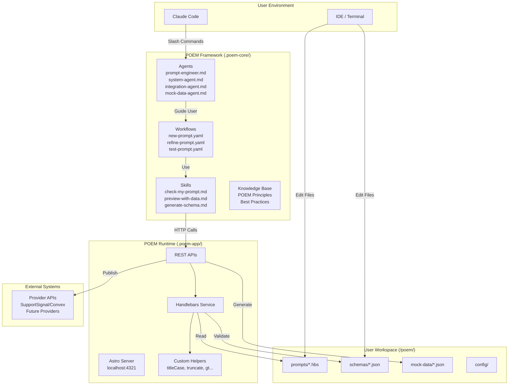
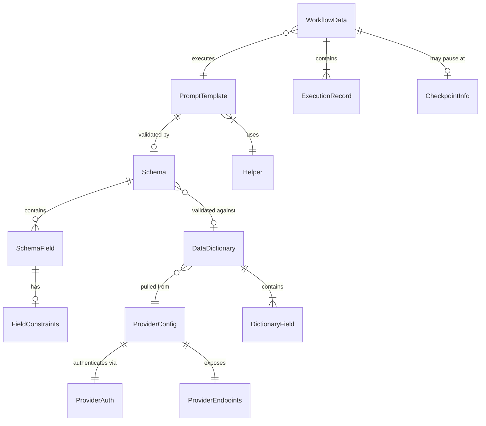
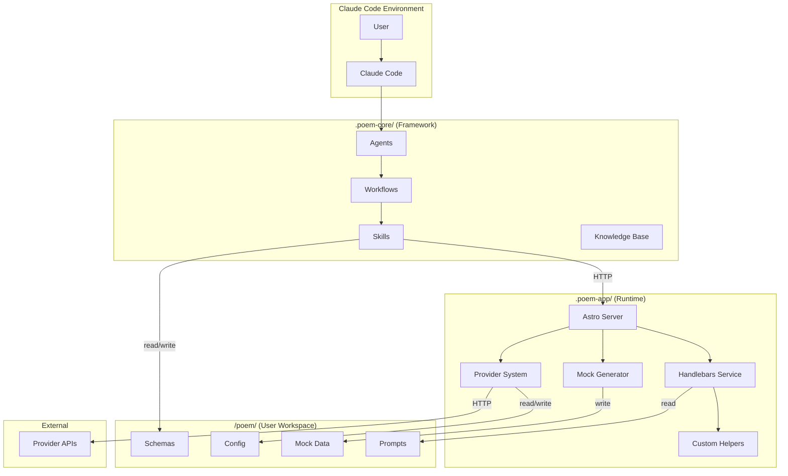
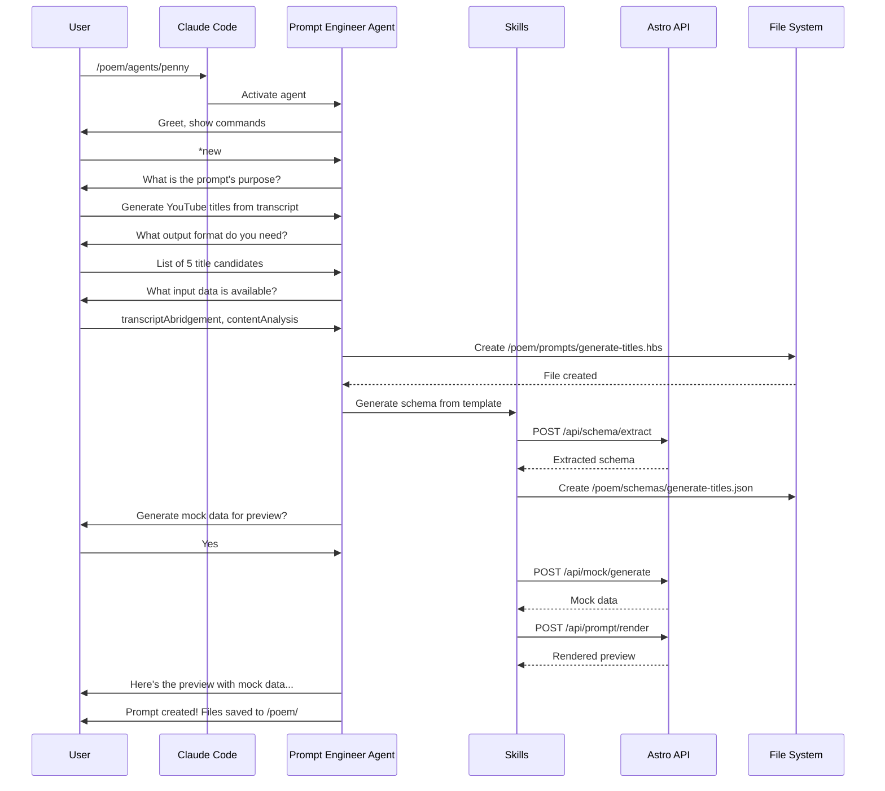
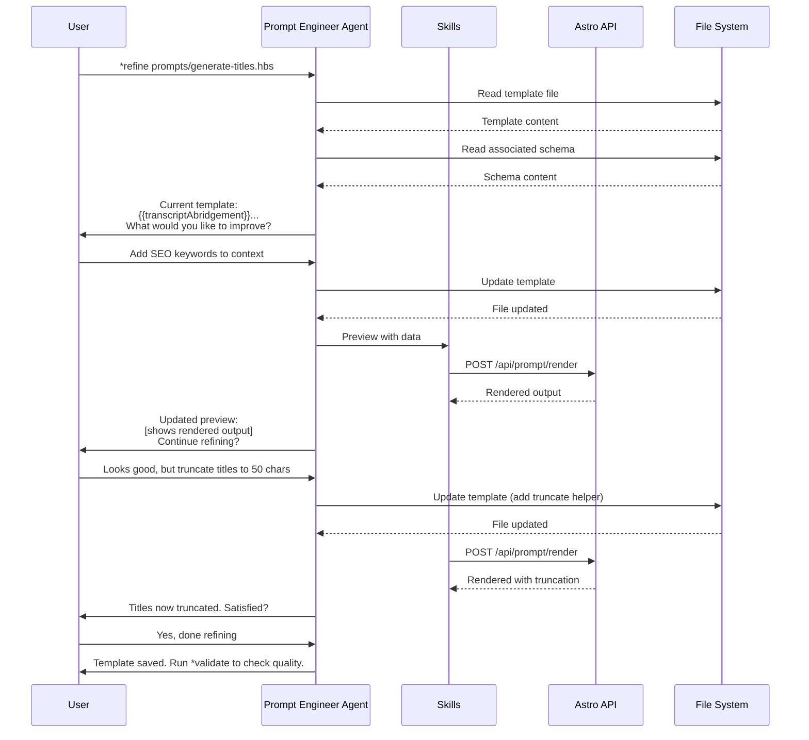
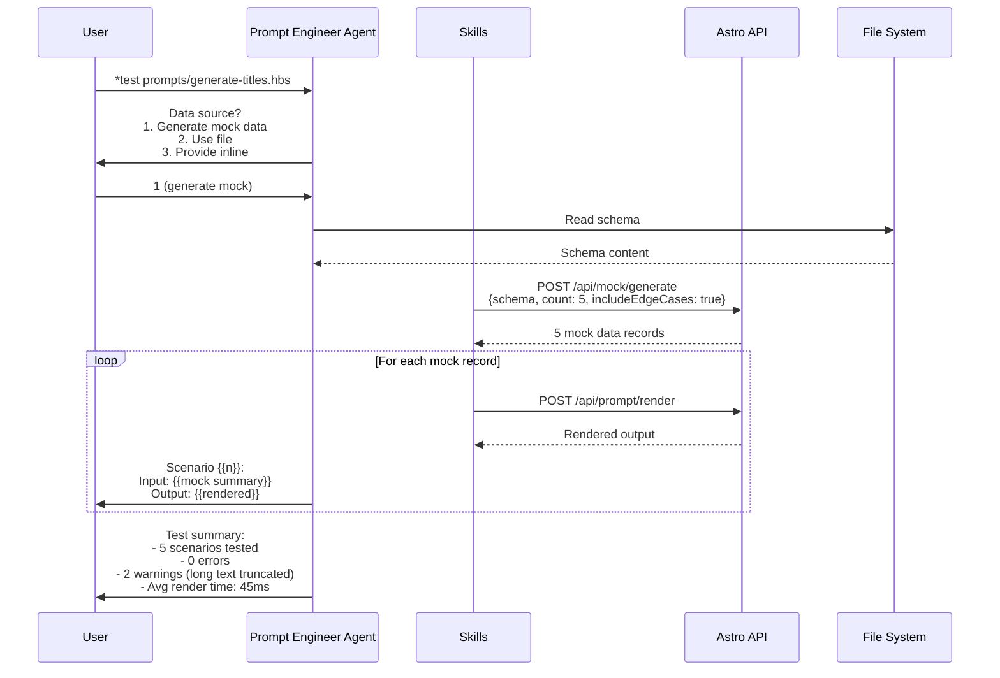
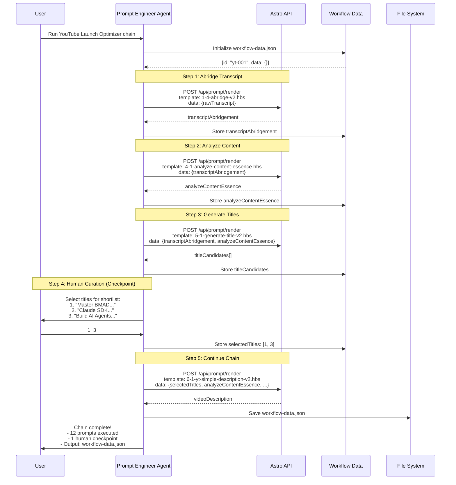
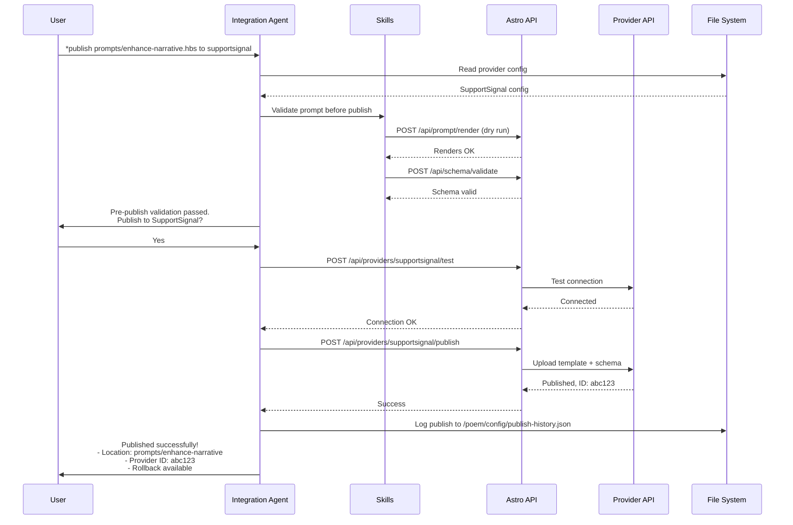
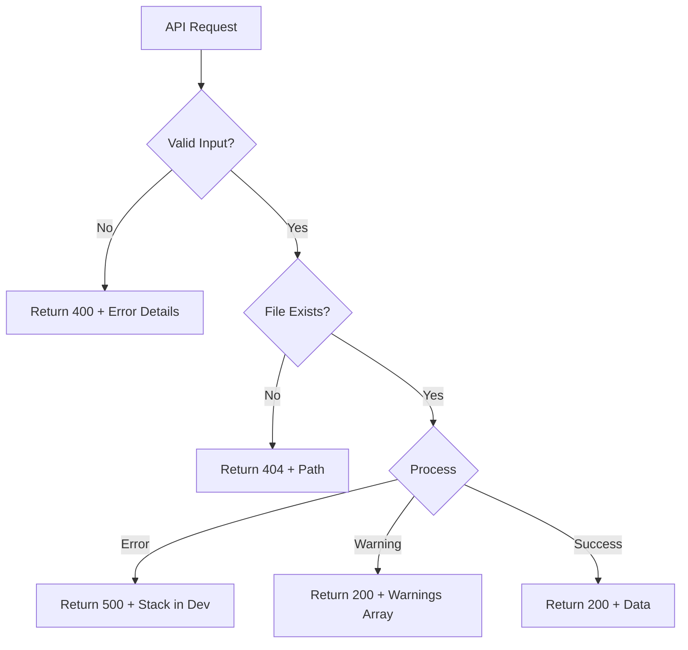

# POEM Architecture Document

## Introduction

This document outlines the complete architecture for **POEM** (Prompt Orchestration and Engineering Method), a Prompt Engineering Operating System designed to run on Claude Code.

**POEM is NOT a traditional fullstack application.** It is a **hybrid system**:

- **95% Document-Based Framework**: Agents (YAML + Markdown), workflows (YAML), templates (Handlebars), schemas (JSON), skills (Markdown) — similar to BMAD
- **5% Runtime Tool**: `.poem-app/` Astro server providing Handlebars engine, API endpoints, and provider integrations

This unified architecture document covers both the document framework and the runtime infrastructure, serving as the single source of truth for AI-driven development.

### Starter Template or Existing Project

**N/A - Greenfield project** with specific structural influences:

- **BMAD v4.44.3**: POEM follows BMAD's proven framework architecture pattern (`.bmad-core/` → `.poem-core/`)
- **Astro**: Latest version selected for runtime server due to file-based routing, TypeScript support, and minimal overhead
- **No existing codebase**: This is a new framework being built from scratch

### Change Log

| Date       | Version | Description                | Author                    |
| ---------- | ------- | -------------------------- | ------------------------- |
| 2025-12-08 | 0.1     | Initial architecture draft | Winston (Architect Agent) |

---

## High-Level Architecture

### Technical Summary

POEM employs a **Document Framework + Local Runtime** architecture pattern, pioneered by BMAD. The system consists of three parts installed into user projects: `.poem-core/` (agents, workflows, skills, knowledge base), `.poem-app/` (Astro server with Handlebars engine and provider APIs), and `/poem/` (user workspace for prompts, schemas, mappings).

The frontend is **conversation-first** — users interact via Claude Code slash commands and agent-guided workflows, not a visual UI. The Astro server runs locally as a background service, providing REST API endpoints for template rendering, schema extraction, and provider integration. This architecture enables offline operation for core functionality while supporting extensible external integrations through the provider pattern.

The key architectural insight is that most "development" in POEM involves creating and editing **documents** (prompts, schemas, workflows), not writing code. The Astro runtime exists solely to provide capabilities that cannot be performed in conversation: Handlebars template compilation, custom helper execution, and HTTP calls to external systems.

### Platform and Infrastructure Choice

**Platform:** Local Development (No Cloud Infrastructure)

POEM runs entirely on the developer's local machine:

- **Runtime**: Node.js (cross-platform: macOS, Linux, Windows)
- **Server**: Astro (local, configurable port)
- **Storage**: File-based (no database)
- **Distribution**: NPM (`npx poem-os install`)

**Key Services:**

| Service              | Technology    | Purpose                                         |
| -------------------- | ------------- | ----------------------------------------------- |
| Template Engine      | Handlebars.js | Compile and render .hbs templates               |
| API Server           | Astro         | REST endpoints for rendering, schema extraction |
| Mock Data            | Faker.js      | Generate test data from schemas                 |
| Package Distribution | NPM           | `npx poem-os install` command                   |

**Deployment Host and Regions:** N/A — Local development tool only. No cloud hosting required.

**Rationale:** POEM is a developer tool, not a deployed application. Cloud infrastructure would add unnecessary complexity. File-based storage ensures data privacy (no production data leaves the user's machine) and enables offline operation.

### Repository Structure

**Structure:** Monorepo with NPM Workspaces

```
poem-os/poem/
├── packages/
│   ├── poem-core/    → Becomes .poem-core/ when installed
│   └── poem-app/     → Becomes .poem-app/ when installed
└── package.json      → Published as 'poem-os' on NPM
```

**Monorepo Tool:** NPM Workspaces (native, no additional tooling)

**Package Organization:**

- `packages/poem-core/` — Document framework (agents, workflows, skills, templates, data)
- `packages/poem-app/` — Astro runtime server (API endpoints, Handlebars service, providers)
- Root — NPX installer, shared configuration, documentation

**Rationale:**

- Single repository simplifies versioning, testing, and release coordination
- NPM workspaces are native and require no additional tooling (Nx, Turborepo unnecessary for this scale)
- Clear separation between framework documents and runtime code

### High Level Architecture Diagram



### Architectural Patterns

- **Document Framework Pattern:** Most system components are documents (Markdown, YAML, JSON, Handlebars) that Claude Code interprets, not executable code. _Rationale:_ Enables rapid iteration through conversation, follows BMAD's proven model.

- **Local Runtime Service Pattern:** A persistent local server (Astro) provides capabilities requiring compilation or external I/O. _Rationale:_ Handlebars needs template compilation; helpers need JavaScript execution; providers need HTTP calls.

- **Agent-Guided Workflow Pattern:** Users interact through specialized AI agents that guide multi-step workflows. _Rationale:_ Provides systematic assistance while maintaining human control over creative decisions.

- **Skill-Based Autonomy Pattern:** Skills are self-describing autonomous capabilities that Claude invokes based on context. _Rationale:_ Enables proactive assistance without requiring explicit user commands.

- **Provider Abstraction Pattern:** External system integration through abstract interfaces with concrete implementations per provider. _Rationale:_ Enables extensibility to new platforms without core framework changes.

- **File-Based Storage Pattern:** All user data stored as files in the workspace directory, no database. _Rationale:_ Simplicity, portability, version control compatibility, offline operation.

- **Schema-Driven Development Pattern:** JSON schemas define data structures; templates, mock data, and validation derive from schemas. _Rationale:_ Single source of truth reduces inconsistencies.

---

## Tech Stack

This is the **definitive technology selection** for POEM. Note that POEM is a hybrid system, so categories are adapted accordingly.

### Technology Stack Table

| Category                 | Technology        | Version      | Purpose                                       | Rationale                                                  |
| ------------------------ | ----------------- | ------------ | --------------------------------------------- | ---------------------------------------------------------- |
| **Framework Documents**  |
| Agent Definitions        | Markdown + YAML   | -            | Define AI agent personas, commands, behaviors | BMAD v4 pattern; readable, maintainable                    |
| Workflows                | YAML              | -            | Define multi-step guided processes            | Declarative, template-driven per BMAD                      |
| Skills                   | Markdown          | -            | Define autonomous capabilities                | Self-describing, context-aware                             |
| Prompt Templates         | Handlebars (.hbs) | 4.x          | User prompt files with placeholders           | Industry standard templating; helpers, conditionals, loops |
| Schemas                  | JSON              | -            | Define data structures for prompts            | Simple, universal, tool-friendly                           |
| **Runtime Server**       |
| Server Framework         | Astro             | 4.x (latest) | API endpoints, file-based routing             | Fast startup, TypeScript native, minimal overhead          |
| Runtime Language         | TypeScript        | 5.x          | Type-safe server code                         | Type safety, IDE support, modern JS features               |
| Node.js                  | Node.js           | 20.x LTS     | Server runtime                                | Cross-platform, stable LTS                                 |
| **Template Engine**      |
| Templating               | Handlebars.js     | 4.x          | Compile and render .hbs templates             | Mature, extensible helpers, logic-less by default          |
| **Mock Data**            |
| Fake Data                | @faker-js/faker   | 8.x          | Generate realistic test data                  | Comprehensive data types, TypeScript support               |
| **Styling (Minimal)**    |
| CSS Framework            | Tailwind CSS      | 3.x          | Future visualization pages                    | Utility-first, minimal footprint                           |
| **Testing**              |
| Unit/Integration         | Vitest            | 1.x          | Test Astro APIs, Handlebars service           | Fast, Vite-native, TypeScript support                      |
| Manual Testing           | Claude Code       | -            | Test agent workflows, skills                  | Conversation-based validation                              |
| **Build & Distribution** |
| Package Manager          | npm               | 10.x         | Dependency management, workspaces             | Native workspaces, no extra tooling                        |
| Distribution             | npx               | -            | `npx poem-os install`                         | Zero-install execution                                     |
| Bundler                  | Vite              | 5.x          | Astro's built-in bundler                      | Fast builds, HMR                                           |
| **Development**          |
| Linting                  | ESLint            | 8.x          | Code quality                                  | Standard, configurable                                     |
| Formatting               | Prettier          | 3.x          | Code formatting                               | Consistent style                                           |
| **Not Used**             |
| Database                 | None              | -            | File-based storage only                       | Simplicity, privacy, offline operation                     |
| Authentication           | None              | -            | Local tool, no auth needed                    | Single-user developer tool                                 |
| CI/CD                    | Phased            | -            | Manual-first, automate incrementally          | See CI/CD Strategy section                                 |
| E2E Testing              | None              | -            | Not a deployed web app                        | Manual testing via Claude Code                             |

### Key Technology Decisions

**Why Astro over Express/Fastify?**

- File-based API routing (`src/pages/api/*.ts`) matches POEM's file-centric philosophy
- Built-in TypeScript support without configuration
- Vite-powered with fast startup (< 3 seconds per NFR2)
- Future option for visualization pages if needed

**Why Handlebars over other templating?**

- Logic-less by default encourages clean prompts
- Custom helpers enable domain-specific formatting
- Mature ecosystem with predictable behavior
- Already specified in PRD requirements

**Why Vitest over Jest?**

- Native Vite integration (Astro uses Vite)
- Faster execution, modern API
- Compatible with existing Jest patterns

---

## Data Models

POEM's data models are primarily **file-based documents**, not database entities. These models define the structure of files that users and agents create/manipulate.

### Prompt Template

**Purpose:** Handlebars template file containing an AI prompt with data placeholders.

**Key Attributes:**

- `path`: string - File path relative to `/poem/prompts/`
- `content`: string - Handlebars template content
- `placeholders`: string[] - Extracted placeholder names
- `helpers`: string[] - Required Handlebars helpers
- `schemaPath`: string - Associated schema file path

```typescript
interface PromptTemplate {
  /** Relative path from /poem/prompts/ */
  path: string;

  /** Raw Handlebars template content */
  content: string;

  /** Extracted placeholders from template */
  placeholders: PlaceholderInfo[];

  /** Required helper names */
  requiredHelpers: string[];

  /** Associated schema path (if exists) */
  schemaPath?: string;
}

interface PlaceholderInfo {
  /** Full placeholder path e.g., "user.name" */
  path: string;

  /** Inferred type from usage */
  inferredType: "string" | "number" | "boolean" | "array" | "object";

  /** Is inside #each block */
  isArrayItem: boolean;

  /** Is inside #if block */
  isConditional: boolean;
}
```

**Relationships:**

- Has one optional Schema (validation)
- May reference many Helpers
- May be part of a Workflow chain

---

### Schema

**Purpose:** JSON document defining the data structure required by a prompt template.

**Key Attributes:**

- `path`: string - File path relative to `/poem/schemas/`
- `fields`: Field[] - Schema field definitions
- `version`: string - Schema version for evolution

```typescript
interface Schema {
  /** Relative path from /poem/schemas/ */
  path: string;

  /** Schema version */
  version: string;

  /** Human-readable description */
  description?: string;

  /** Field definitions */
  fields: SchemaField[];
}

interface SchemaField {
  /** Field name (supports dot notation for nesting) */
  name: string;

  /** Field type */
  type: "string" | "number" | "boolean" | "array" | "object";

  /** Is field required */
  required: boolean;

  /** Human-readable description */
  description?: string;

  /** For arrays, the item type */
  items?: SchemaField;

  /** For objects, nested fields */
  properties?: SchemaField[];

  /** Constraints for mock data generation */
  constraints?: FieldConstraints;
}

interface FieldConstraints {
  /** Min/max for numbers */
  min?: number;
  max?: number;

  /** Min/max length for strings */
  minLength?: number;
  maxLength?: number;

  /** Enum values */
  enum?: string[];

  /** Faker.js method hint e.g., "person.firstName" */
  fakerHint?: string;

  /** Regex pattern */
  pattern?: string;
}
```

**Relationships:**

- Belongs to one or more PromptTemplates
- Used by MockDataGenerator
- May reference a DataDictionary for validation

---

### Workflow Data

**Purpose:** Runtime state that accumulates as prompts execute in a chain.

**Key Attributes:**

- `id`: string - Workflow execution identifier
- `templateChain`: string[] - Ordered list of executed templates
- `data`: Record - Accumulated field values

```typescript
interface WorkflowData {
  /** Unique execution ID */
  id: string;

  /** Workflow name/identifier */
  workflowName: string;

  /** Timestamps */
  startedAt: string;
  updatedAt: string;

  /** Chain of executed templates */
  executedTemplates: ExecutionRecord[];

  /** Accumulated data from all prompts */
  data: Record<string, unknown>;

  /** Current checkpoint (if paused for human input) */
  checkpoint?: CheckpointInfo;
}

interface ExecutionRecord {
  /** Template path */
  templatePath: string;

  /** Execution timestamp */
  executedAt: string;

  /** Fields added to workflow data */
  outputFields: string[];

  /** Render time in ms */
  renderTimeMs: number;
}

interface CheckpointInfo {
  /** Template requiring human input */
  templatePath: string;

  /** Type of input needed */
  inputType: "selection" | "freeform" | "approval";

  /** Options for selection type */
  options?: string[];

  /** Field to store result */
  outputField: string;
}
```

**Relationships:**

- References multiple PromptTemplates (chain)
- Persisted to `/poem/workflow-data/` during execution

---

## Workflow Definition Structure

Workflows in POEM define multi-step prompt execution sequences where outputs from one prompt become inputs to subsequent prompts. They enable progressive data accumulation, human-in-the-loop checkpoints, and orchestration of complex prompt pipelines.

**Key Characteristics:**
- **Sequential execution** - Steps run in order (parallel execution is future enhancement)
- **Data accumulation** - Each step reads from and writes to a shared data bus
- **Auto-derived schema** - Workflow attributes are automatically derived from step inputs/outputs
- **Optional organization** - Sections provide hierarchical grouping for complex workflows

---

### Basic Workflow Format

A minimal workflow consists of a name, description, and a list of steps:

```yaml
name: video-summarization
description: Summarizes and abridges video transcripts for content analysis

steps:
  - name: Summarize Transcript
    prompt: prompts/summarize-video.hbs
    inputs:
      - transcript
    outputs:
      - transcriptSummary

  - name: Abridge Summary
    prompt: prompts/abridge-video.hbs
    inputs:
      - transcript
      - transcriptSummary
    outputs:
      - transcriptAbridgement
```

**Location:** `/poem/workflows/video-summarization.yaml`

---

### Workflow with Sections

For larger workflows, sections provide organizational grouping of related steps. Sections represent standard operating procedures (SOPs) within the overall workflow:

```yaml
name: youtube-launch-optimizer
description: Complete YouTube video publishing workflow with 11 sections and 53 prompts

sections:
  - name: Video Preparation
    description: Initial transcript processing and content analysis
    steps:
      - name: Configure Workflow
        prompt: prompts/youtube-launch-optimizer/1-1-configure.hbs
        inputs:
          - rawTranscript
          - projectCode
        outputs:
          - transcript
          - shortTitle

      - name: Summarize Video
        prompt: prompts/youtube-launch-optimizer/1-3-summarize-video.hbs
        inputs:
          - transcript
        outputs:
          - transcriptSummary

      - name: Abridge Transcript
        prompt: prompts/youtube-launch-optimizer/1-4-abridge-v2.hbs
        inputs:
          - transcript
          - transcriptSummary
        outputs:
          - transcriptAbridgement

  - name: Content Analysis
    description: Analyze video content for keywords, topics, and themes
    steps:
      - name: Analyze Content Essence
        prompt: prompts/youtube-launch-optimizer/4-1-analyze-content-essence.hbs
        inputs:
          - transcriptAbridgement
        outputs:
          - analyzeContentEssence

      - name: Analyze CTAs and Competitors
        prompt: prompts/youtube-launch-optimizer/4-2-analyze-cta-competitors.hbs
        inputs:
          - transcriptAbridgement
        outputs:
          - analyzeCtaCompetitors

  - name: Title Generation
    description: Generate and select video titles
    steps:
      - name: Generate Title Ideas
        prompt: prompts/youtube-launch-optimizer/5-1-generate-title-v2.hbs
        inputs:
          - transcriptAbridgement
          - analyzeContentEssence
        outputs:
          - titleCandidates

      - name: Select Title Shortlist
        prompt: prompts/youtube-launch-optimizer/5-2-select-title-shortlist.hbs
        inputs:
          - titleCandidates
        outputs:
          - selectedTitles
        checkpoint: true  # Requires human input
```

**Note:** Sections are optional. Simple workflows can use flat step lists. Complex workflows benefit from sectional organization.

---

### Step Structure

Each step defines a single prompt execution with its input and output requirements:

#### Required Fields

| Field | Type | Description | Example |
|-------|------|-------------|---------|
| `name` | string | Human-readable step identifier | "Summarize Transcript" |
| `prompt` | string | Path to Handlebars template (relative to `/poem/prompts/`) | "prompts/summarize-video.hbs" |
| `inputs` | array | List of fields to read from workflow-data | `["transcript", "projectCode"]` |
| `outputs` | array | List of fields to write to workflow-data | `["transcriptSummary"]` |

#### Optional Fields

| Field | Type | Description | Example |
|-------|------|-------------|---------|
| `description` | string | Detailed explanation of step purpose | "Condenses transcript to 500-1000 words" |
| `checkpoint` | boolean | If true, pauses for human input | `true` |
| `conditional` | string | Condition to execute step (future) | `"if: titleCandidates.length > 0"` |

#### Input/Output Rules

**Inputs:**
- Must reference fields that exist in workflow-data (from previous step outputs or initial data)
- Missing inputs cause validation warnings (not errors)
- Steps can access any accumulated workflow-data field

**Outputs:**
- Define what the prompt produces
- Overwriting existing fields is allowed but discouraged
- Arrays and nested objects supported (e.g., `titleCandidates`, `analyzeContentEssence.mainTopic`)

---

### Data Bus (Workflow Schema)

The workflow data bus is a shared key-value store that accumulates data as steps execute. The workflow schema (list of attributes) is **automatically derived** from step inputs and outputs.

#### Automatic Schema Derivation

**Rule:** Union of all step inputs + outputs = workflow attributes

**Example:**

```yaml
steps:
  - name: Step A
    inputs: [transcript]
    outputs: [transcriptSummary]

  - name: Step B
    inputs: [transcript, transcriptSummary]
    outputs: [transcriptAbridgement]

  - name: Step C
    inputs: [transcriptAbridgement]
    outputs: [titleCandidates, selectedTitles]
```

**Derived Schema:**
```
Workflow Attributes:
- transcript
- transcriptSummary
- transcriptAbridgement
- titleCandidates
- selectedTitles
```

#### Schema File Format

For documentation and validation, the derived schema can be exported to JSON:

```json
{
  "name": "video-summarization",
  "version": "1.0.0",
  "description": "Auto-generated from workflow steps",
  "attributes": {
    "transcript": { "type": "string", "required": true },
    "transcriptSummary": { "type": "string", "required": false },
    "transcriptAbridgement": { "type": "string", "required": false },
    "titleCandidates": { "type": "array", "items": { "type": "string" } },
    "selectedTitles": { "type": "array", "items": { "type": "string" } }
  }
}
```

**Location:** `/poem/schemas/workflows/video-summarization.json`

**Note:** This file is generated, not hand-written. It serves as documentation and validation reference.

#### Future: Explicit Attributes Block

While attributes are currently auto-derived from step I/O, a future enhancement will support explicit attribute declarations for:
- **Transient attributes** - Temporary values not tied to any specific step
- **Computed attributes** - Values calculated from other attributes
- **External attributes** - Data injected from sources outside step execution

This explicit declaration is not needed in Epic 4 but will be added when use cases emerge that require it.

#### Reference Example Schemas

Reference examples of workflow schemas can be found in `data/*/schemas/workflow-*.json`. **These are DOCUMENTATION ARTIFACTS created during planning to validate the design.**

**Important**: These files are hand-written for planning purposes. In production:

- Workflow schemas are auto-generated from workflow YAML step I/O declarations
- No manual schema creation is required
- Generated schemas can be exported for validation/debugging purposes

**Example**: `data/youtube-launch-optimizer/schemas/workflow-attributes.json` documents what the YouTube workflow schema will contain when auto-derived from the workflow YAML. This file was created manually by analyzing all 53 prompts to validate that the auto-derivation approach would produce the expected 80+ attributes.

**Verification**: When Epic 4 is complete, the auto-generated schema for `youtube-launch-optimizer.yaml` should match the reference example in `data/`.

**How to Use Reference Examples**:

1. **During Planning**: Create reference schema by manually documenting expected attributes
2. **During Implementation**: Build auto-derivation engine that generates schemas from YAML
3. **Verification**: Compare auto-generated schema to reference example to validate correctness
4. **Production**: Only use auto-generated schemas; reference examples remain in `data/` for documentation

---

### Execution Model

#### Sequential Execution

Workflows execute steps in the order defined:

1. **Initialize workflow-data** with provided inputs (e.g., `rawTranscript`)
2. **For each step:**
   - Read required inputs from workflow-data
   - Render prompt template with input data
   - Execute prompt (send to LLM or mock)
   - Parse output and extract declared output fields
   - Write outputs back to workflow-data
3. **Persist workflow-data** to `/poem/workflow-data/{workflow-id}.json`

#### Data Accumulation Example

```yaml
# Initial state
workflow-data: { rawTranscript: "..." }

# After Step 1 (Summarize)
workflow-data: {
  rawTranscript: "...",
  transcriptSummary: "..."
}

# After Step 2 (Abridge)
workflow-data: {
  rawTranscript: "...",
  transcriptSummary: "...",
  transcriptAbridgement: "..."
}

# After Step 3 (Generate Titles)
workflow-data: {
  rawTranscript: "...",
  transcriptSummary: "...",
  transcriptAbridgement: "...",
  titleCandidates: ["Title 1", "Title 2", "Title 3"]
}
```

#### Checkpoint Pattern (Human-in-the-Loop)

Steps marked with `checkpoint: true` pause execution for human input:

```yaml
- name: Select Title Shortlist
  prompt: prompts/select-title-shortlist.hbs
  inputs: [titleCandidates]
  outputs: [selectedTitles]
  checkpoint: true
```

**Execution:**
1. Prompt renders with `titleCandidates`
2. Agent presents options to user (e.g., "Select 2-3 titles from this list")
3. User makes selection
4. `selectedTitles` written to workflow-data
5. Workflow resumes with next step

**See:** Epic 4 Story 4.7 for checkpoint implementation details

---

### Future Enhancements

#### Parallel Execution

**Purpose:** Execute multiple independent steps concurrently when they don't depend on each other's outputs.

**Use Case:** When 5 prompts all use only `transcript` as input and produce different outputs (keywords, sentiment, topics, themes, entities), they can run in parallel rather than sequentially.

```yaml
steps:
  - name: Parallel Analysis
    parallel: true
    substeps:
      - name: Analyze Keywords
        prompt: prompts/analyze-keywords.hbs
        inputs: [transcript]
        outputs: [keywords]

      - name: Analyze Sentiment
        prompt: prompts/analyze-sentiment.hbs
        inputs: [transcript]
        outputs: [sentiment]

      - name: Analyze Topics
        prompt: prompts/analyze-topics.hbs
        inputs: [transcript]
        outputs: [topics]
```

**Benefits:** Reduces total execution time when steps have no inter-dependencies.

**Status:** Not in Epic 4. Potentially Epic 6 when performance optimization becomes critical.

#### Conditional Execution

```yaml
steps:
  - name: Generate Advanced Title
    prompt: prompts/generate-advanced-title.hbs
    inputs: [transcriptAbridgement, analyzeContentEssence]
    outputs: [advancedTitle]
    condition: "analyzeContentEssence.complexity > 7"
```

**Status:** Not in Epic 4. Potentially Epic 6.

#### DTO Mapping (Parameter Translation)

**Purpose:** Enable prompt reusability by decoupling workflow attribute names from prompt parameter names.

**Problem:** Without DTO mapping, prompts must use workflow-specific attribute names, limiting reusability. A generic `summarize.hbs` prompt expecting `content` input cannot be used in a workflow that has `transcript` as the attribute name.

**Solution:** Map workflow attributes to prompt parameters at the step level:

```yaml
steps:
  - name: Generic Summarize
    prompt: prompts/generic/summarize.hbs  # Expects 'content' input
    inputs:
      - transcript
    outputs:
      - summary
    mapping:
      inputs:
        content: transcript          # Map workflow 'transcript' to prompt 'content'
      outputs:
        summary: transcriptSummary   # Map prompt 'summary' to workflow 'transcriptSummary'
```

**When Needed:**
- Prompts become truly single-responsibility and generic
- Building a library of reusable prompts across multiple workflows
- Different workflows use different naming conventions

**Status:** Future implementation, undefined format. Not in Epic 4. Needed when POEM has a substantial library of generic/reusable prompts. Potentially Epic 5.

**Current Approach:** Prompts reference workflow attributes directly (tight coupling), which is acceptable for workflow-specific prompts like the YouTube Launch Optimizer templates.

#### Workflow Composition (Nested Workflows)

```yaml
name: complete-video-pipeline
description: Full pipeline from raw recording to published video

sections:
  - name: Content Creation
    workflow: workflows/video-production.yaml  # Reference to another workflow

  - name: Publishing
    workflow: workflows/youtube-launch-optimizer.yaml
```

**Status:** Design pattern identified but not yet needed. Potentially Epic 7+.

---

### Implementation Status

| Feature | Epic | Story | Status |
|---------|------|-------|--------|
| Basic workflow execution | 4 | 4.6 | In PRD |
| Checkpoint pattern | 4 | 4.7 | In PRD |
| Workflow schema derivation | 4 | 4.2 (modified) | Needs update |
| Sequential step execution | 4 | 4.6 | In PRD |
| Section support | 4 | 4.1, 4.6 | Implied, needs formalization |
| Workflow YAML parsing | 4 | 4.6 | Needs implementation |
| Workflow-data persistence | 4 | 4.6 | In PRD (AC6) |
| Parallel execution | 6+ | TBD | Future |
| Conditional execution | 6+ | TBD | Future |
| DTO mapping | 5+ | TBD | Future |
| Explicit attributes block | 5+ | TBD | Future |
| Workflow composition | 7+ | TBD | Future |

---

### Examples from YouTube Launch Optimizer

The YouTube Launch Optimizer workflow demonstrates all key concepts:

- **11 sections** (Video Preparation, Title Generation, Description, Thumbnail, etc.)
- **53 prompts** organized by section
- **37 workflow attributes** (transcript, titleCandidates, selectedTitles, etc.)
- **Sequential execution** through all sections
- **Human checkpoints** (title selection, thumbnail selection)
- **Progressive data accumulation** (each section builds on previous outputs)

**Full workflow:** `/poem/workflows/youtube-launch-optimizer.yaml` (Story 4.1)
**Schema:** `/poem/schemas/workflows/youtube-launch-optimizer.json` (derived from workflow)

---

### See Also

- **PRD Epic 4:** YouTube Automation Workflow (System Validation)
- **Story 4.6:** Run Prompt Chain (Section 1 → Section 5)
- **Story 4.7:** Human-in-the-Loop Checkpoint
- **Data Models:** WorkflowData interface (this document)
- **API Specification:** /api/workflow/* endpoints (this document)

---

### Provider Configuration

**Purpose:** Configuration for external system integration.

**Key Attributes:**

- `name`: string - Provider identifier
- `type`: string - Provider type (e.g., 'convex', 'supabase')
- `endpoints`: Record - API endpoint configuration

```typescript
interface ProviderConfig {
  /** Unique provider name */
  name: string;

  /** Provider type */
  type: "convex" | "supabase" | "custom";

  /** Base URL for API calls */
  baseUrl: string;

  /** Authentication configuration */
  auth: ProviderAuth;

  /** Available endpoints */
  endpoints: ProviderEndpoints;

  /** Provider-specific options */
  options?: Record<string, unknown>;
}

interface ProviderAuth {
  /** Auth type */
  type: "bearer" | "api-key" | "basic" | "none";

  /** Environment variable containing credential */
  envVar?: string;

  /** Header name for API key */
  headerName?: string;
}

interface ProviderEndpoints {
  /** Endpoint for pulling data dictionary */
  pullDictionary?: string;

  /** Endpoint for publishing prompts */
  publishPrompt?: string;

  /** Endpoint for testing connection */
  testConnection?: string;
}
```

**Relationships:**

- Used by Integration Agent
- Stored in `/poem/config/providers/`

---

### Data Dictionary

**Purpose:** Field definitions pulled from an external provider.

```typescript
interface DataDictionary {
  /** Provider this dictionary came from */
  providerName: string;

  /** When dictionary was pulled */
  pulledAt: string;

  /** Dictionary version from provider */
  version?: string;

  /** Available fields */
  fields: DictionaryField[];
}

interface DictionaryField {
  /** Full field path */
  path: string;

  /** Field type */
  type: string;

  /** Human description */
  description?: string;

  /** Example value */
  example?: unknown;

  /** Is nullable */
  nullable: boolean;

  /** Enum values if applicable */
  enumValues?: string[];
}
```

**Relationships:**

- Pulled from Provider
- Used for schema validation
- Stored in `/poem/schemas/dictionaries/`

---

### Entity Relationship Diagram



---

## API Specification

POEM's Astro server exposes REST API endpoints that skills and agents call via HTTP. No authentication is required (local development tool).

### REST API Specification

```yaml
openapi: 3.0.0
info:
  title: POEM Runtime API
  version: 1.0.0
  description: |
    Local REST API for POEM (Prompt Orchestration and Engineering Method).
    Called by Claude Code skills and agents for template rendering,
    schema operations, and provider integration.

servers:
  - url: http://localhost:4321/api
    description: Local development server (port configurable)

paths:
  /health:
    get:
      summary: Health check endpoint
      description: Returns server status and version
      responses:
        "200":
          description: Server is healthy
          content:
            application/json:
              schema:
                type: object
                properties:
                  status:
                    type: string
                    example: "ok"
                  version:
                    type: string
                    example: "1.0.0"
                  uptime:
                    type: number
                    description: Uptime in seconds
                  helpersLoaded:
                    type: number
                    description: Count of registered Handlebars helpers

  /prompt/render:
    post:
      summary: Render a Handlebars template with data
      description: |
        Compiles and renders a prompt template with provided data.
        Returns rendered output and metadata.
      requestBody:
        required: true
        content:
          application/json:
            schema:
              type: object
              required:
                - template
              properties:
                template:
                  type: string
                  description: Template path (relative to /poem/prompts/) or raw template content
                  example: "youtube-launch-optimizer/5-1-generate-title-v2.hbs"
                data:
                  type: object
                  description: Data to render template with
                  example:
                    transcriptAbridgement: "This video covers..."
                    analyzeContentEssence:
                      mainTopic: "AI Development"
                isRawTemplate:
                  type: boolean
                  description: If true, template field contains raw Handlebars content
                  default: false
      responses:
        "200":
          description: Template rendered successfully
          content:
            application/json:
              schema:
                type: object
                properties:
                  rendered:
                    type: string
                    description: Rendered template output
                  renderTimeMs:
                    type: number
                    description: Render time in milliseconds
                  warnings:
                    type: array
                    items:
                      type: string
                    description: Missing fields, unused data, etc.
                  templatePath:
                    type: string
                    description: Resolved template path
        "400":
          description: Invalid request (missing template, syntax error)
        "404":
          description: Template file not found

  /schema/extract:
    post:
      summary: Extract schema from template placeholders
      description: |
        Parses a Handlebars template and extracts a JSON schema
        based on placeholder usage patterns.
      requestBody:
        required: true
        content:
          application/json:
            schema:
              type: object
              required:
                - template
              properties:
                template:
                  type: string
                  description: Template path or raw content
                isRawTemplate:
                  type: boolean
                  default: false
      responses:
        "200":
          description: Schema extracted successfully
          content:
            application/json:
              schema:
                type: object
                properties:
                  schema:
                    type: object
                    description: Extracted schema
                  requiredHelpers:
                    type: array
                    items:
                      type: string
                    description: Helper names used in template
                  templatePath:
                    type: string

  /schema/validate:
    post:
      summary: Validate data against a schema
      description: Checks if provided data matches schema requirements
      requestBody:
        required: true
        content:
          application/json:
            schema:
              type: object
              required:
                - schema
                - data
              properties:
                schema:
                  type: string
                  description: Schema path or inline schema object
                data:
                  type: object
                  description: Data to validate
      responses:
        "200":
          description: Validation result
          content:
            application/json:
              schema:
                type: object
                properties:
                  valid:
                    type: boolean
                  errors:
                    type: array
                    items:
                      type: object
                      properties:
                        field:
                          type: string
                        message:
                          type: string

  /mock/generate:
    post:
      summary: Generate mock data from schema
      description: |
        Uses Faker.js to generate realistic mock data
        based on schema field definitions and constraints.
      requestBody:
        required: true
        content:
          application/json:
            schema:
              type: object
              required:
                - schema
              properties:
                schema:
                  type: string
                  description: Schema path or inline schema object
                count:
                  type: number
                  description: Number of mock records to generate
                  default: 1
                seed:
                  type: number
                  description: Random seed for reproducible generation
                includeEdgeCases:
                  type: boolean
                  description: Include edge cases (empty, long, special chars)
                  default: false
      responses:
        "200":
          description: Mock data generated
          content:
            application/json:
              schema:
                type: object
                properties:
                  data:
                    type: array
                    items:
                      type: object
                  count:
                    type: number
                  seed:
                    type: number

  /helpers:
    get:
      summary: List registered Handlebars helpers
      description: Returns all available helpers with their descriptions
      responses:
        "200":
          description: List of helpers
          content:
            application/json:
              schema:
                type: object
                properties:
                  helpers:
                    type: array
                    items:
                      type: object
                      properties:
                        name:
                          type: string
                        description:
                          type: string
                        example:
                          type: string

  /helpers/test:
    post:
      summary: Test a Handlebars helper
      description: Execute a helper with test inputs
      requestBody:
        required: true
        content:
          application/json:
            schema:
              type: object
              required:
                - helper
                - args
              properties:
                helper:
                  type: string
                  description: Helper name
                args:
                  type: array
                  description: Arguments to pass to helper
      responses:
        "200":
          description: Helper executed
          content:
            application/json:
              schema:
                type: object
                properties:
                  result:
                    type: string
                  success:
                    type: boolean

  /providers/{name}/test:
    post:
      summary: Test provider connection
      description: Verify connectivity to external provider
      parameters:
        - name: name
          in: path
          required: true
          schema:
            type: string
          description: Provider name (e.g., "supportsignal")
      responses:
        "200":
          description: Connection test result
          content:
            application/json:
              schema:
                type: object
                properties:
                  connected:
                    type: boolean
                  latencyMs:
                    type: number
                  error:
                    type: string

  /providers/{name}/dictionary:
    get:
      summary: Pull data dictionary from provider
      description: Fetch available fields and types from external system
      parameters:
        - name: name
          in: path
          required: true
          schema:
            type: string
      responses:
        "200":
          description: Data dictionary
          content:
            application/json:
              schema:
                type: object

  /providers/{name}/publish:
    post:
      summary: Publish prompt to provider
      description: Deploy a prompt template to external system
      parameters:
        - name: name
          in: path
          required: true
          schema:
            type: string
      requestBody:
        required: true
        content:
          application/json:
            schema:
              type: object
              required:
                - templatePath
              properties:
                templatePath:
                  type: string
                  description: Path to template file
                schemaPath:
                  type: string
                  description: Path to associated schema
                targetLocation:
                  type: string
                  description: Provider-specific deployment location
      responses:
        "200":
          description: Publish result
          content:
            application/json:
              schema:
                type: object
                properties:
                  success:
                    type: boolean
                  publishedAt:
                    type: string
                    format: date-time
                  location:
                    type: string
```

### API Summary Table

| Endpoint                           | Method | Purpose                        | NFR         |
| ---------------------------------- | ------ | ------------------------------ | ----------- |
| `/api/health`                      | GET    | Server status check            | -           |
| `/api/prompt/render`               | POST   | Render template with data      | < 1s (NFR3) |
| `/api/schema/extract`              | POST   | Extract schema from template   | -           |
| `/api/schema/validate`             | POST   | Validate data against schema   | -           |
| `/api/mock/generate`               | POST   | Generate mock data from schema | -           |
| `/api/helpers`                     | GET    | List available helpers         | -           |
| `/api/helpers/test`                | POST   | Test a helper                  | -           |
| `/api/providers/{name}/test`       | POST   | Test provider connection       | -           |
| `/api/providers/{name}/dictionary` | GET    | Pull data dictionary           | -           |
| `/api/providers/{name}/publish`    | POST   | Publish prompt to provider     | -           |

---

## Components

POEM's components are organized into three installation targets: the framework (`.poem-core/`), the runtime (`.poem-app/`), and the user workspace (`/poem/`).

### Component: Agents (poem-core)

**Responsibility:** Define AI agent personas that guide users through workflows via Claude Code slash commands.

**Key Interfaces:**

- Slash command activation: `/poem/agents/{agent-name}`
- Agent commands: `*new`, `*refine`, `*test`, `*help`, etc.
- Workflow invocation based on user requests

**Dependencies:**

- Workflows (invokes based on user needs)
- Skills (uses for autonomous operations)
- Knowledge Base (consults for POEM principles)

**Technology Stack:** Markdown files with YAML frontmatter (BMAD v4 pattern)

**Agents:**

| Agent             | File                          | Primary Commands                                        |
| ----------------- | ----------------------------- | ------------------------------------------------------- |
| Prompt Engineer   | `agents/prompt-engineer.md`   | `*new`, `*refine`, `*test`, `*validate`                 |
| System Agent      | `agents/system-agent.md`      | `*add-helper`, `*server-status`, `*create-provider`     |
| Integration Agent | `agents/integration-agent.md` | `*connect`, `*pull-dictionary`, `*publish`              |
| Mock Data Agent   | `agents/mock-data-agent.md`   | `*generate-mock`, `*create-scenario`, `*curate-library` |

---

### Component: Workflows (poem-core)

**Responsibility:** Define multi-step guided processes as YAML templates that agents execute.

**Key Interfaces:**

- Invoked by agents based on command or user request
- Step-by-step execution with user interaction
- Calls skills and APIs as needed

**Dependencies:**

- Skills (invokes for specific operations)
- Astro APIs (calls for rendering, schema operations)
- User Workspace (reads/writes files)

**Technology Stack:** YAML workflow definitions (BMAD v4 pattern)

**Workflows:**

| Workflow        | File                             | Steps                                                        |
| --------------- | -------------------------------- | ------------------------------------------------------------ |
| New Prompt      | `workflows/new-prompt.yaml`      | Gather purpose → Create template → Generate schema → Preview |
| Refine Prompt   | `workflows/refine-prompt.yaml`   | Load → Test → Identify issues → Update → Repeat              |
| Test Prompt     | `workflows/test-prompt.yaml`     | Select data source → Render → Report                         |
| Validate Prompt | `workflows/validate-prompt.yaml` | Check syntax → Validate schema → Check helpers → Report      |
| Deploy Prompt   | `workflows/deploy-prompt.yaml`   | Validate → Test connection → Publish → Confirm               |
| Add Helper      | `workflows/add-helper.yaml`      | Describe need → Generate code → Register → Test              |

---

### Component: Skills (poem-core)

**Responsibility:** Autonomous single-responsibility capabilities that Claude invokes based on context.

**Key Interfaces:**

- Self-describing (suggest when useful)
- Invoke via context, not explicit commands
- Call Astro APIs for heavy operations

**Dependencies:**

- Astro APIs (HTTP calls for rendering, schema extraction)
- User Workspace (file operations)

**Technology Stack:** Markdown skill definitions

**Skills:**

| Skill             | File                          | Purpose                       |
| ----------------- | ----------------------------- | ----------------------------- |
| Check My Prompt   | `skills/check-my-prompt.md`   | Validate prompt structure     |
| Preview with Data | `skills/preview-with-data.md` | Render with mock/example data |
| Generate Schema   | `skills/generate-schema.md`   | Extract schema from template  |
| Find Fields       | `skills/find-fields.md`       | Search data dictionaries      |
| Validate Schema   | `skills/validate-schema.md`   | Check against dictionary      |
| Suggest Mappings  | `skills/suggest-mappings.md`  | Recommend field mappings      |
| Pull Dictionary   | `skills/pull-dictionary.md`   | Import from provider          |
| Publish Prompt    | `skills/publish-prompt.md`    | Deploy to production          |

---

### Component: Astro Server (poem-app)

**Responsibility:** Provide HTTP server with REST APIs for template rendering, schema operations, and provider integration.

**Key Interfaces:**

- REST API endpoints (see API Specification)
- HTTP calls from skills and workflows
- File system access to user workspace

**Dependencies:**

- Handlebars Service (template operations)
- Provider implementations (external integrations)
- User Workspace (file access)

**Technology Stack:** Astro 4.x, TypeScript, Node.js

---

### Component: Handlebars Service (poem-app)

**Responsibility:** Compile Handlebars templates, register helpers, render with data.

**Key Interfaces:**

- `compile(template: string): CompiledTemplate`
- `render(compiled: CompiledTemplate, data: object): string`
- `registerHelper(name: string, fn: Function): void`
- `extractPlaceholders(template: string): PlaceholderInfo[]`

**Dependencies:**

- Custom Helpers (loaded from helpers directory)
- File System (read template files)

**Technology Stack:** Handlebars.js 4.x

**Initialization:**

1. Server starts
2. Scan `src/services/handlebars/helpers/` directory
3. Load and register all `.js` helper files
4. Watch directory for hot-reload

---

### Component: Custom Helpers (poem-app)

**Responsibility:** Provide domain-specific formatting and transformation functions for Handlebars templates.

**Key Interfaces:**

- Handlebars helper signature: `(args..., options) => string`
- Auto-registered on server start
- Hot-reload on file change

**Dependencies:**

- Handlebars Service (registration)

**Technology Stack:** JavaScript/TypeScript modules

**Built-in Helpers:**

| Helper            | Purpose           | Example                                       |
| ----------------- | ----------------- | --------------------------------------------- |
| `titleCase`       | Title case string | `{{titleCase "hello world"}}` → "Hello World" |
| `upperCase`       | Uppercase string  | `{{upperCase "hello"}}` → "HELLO"             |
| `lowerCase`       | Lowercase string  | `{{lowerCase "HELLO"}}` → "hello"             |
| `truncate`        | Limit length      | `{{truncate title 49}}` → first 49 chars      |
| `default`         | Fallback value    | `{{default value "N/A"}}`                     |
| `json`            | JSON stringify    | `{{json object}}`                             |
| `dateFormat`      | Format date       | `{{dateFormat date "YYYY-MM-DD"}}`            |
| `gt`              | Greater than      | `{{#if (gt count 10)}}`                       |
| `join`            | Join array        | `{{join items ", "}}`                         |
| `formatTimestamp` | MM:SS format      | `{{formatTimestamp 125}}` → "2:05"            |

---

### Component: Provider System (poem-app)

**Responsibility:** Abstract interface for external system integration with concrete implementations.

**Key Interfaces:**

- `testConnection(): Promise<ConnectionResult>`
- `pullDictionary(): Promise<DataDictionary>`
- `publishPrompt(template, schema): Promise<PublishResult>`

**Dependencies:**

- Provider configurations (from user workspace)
- External system APIs

**Technology Stack:** TypeScript interfaces, Astro API routes

**Provider Structure:**

```
src/pages/api/providers/
├── _base.ts           # Abstract provider interface
├── mock/              # Mock provider for testing
│   ├── test.ts
│   ├── dictionary.ts
│   └── publish.ts
└── supportsignal/     # SupportSignal/Convex provider
    ├── test.ts
    ├── dictionary.ts
    └── publish.ts
```

---

### Component: Mock Data Generator (poem-app)

**Responsibility:** Generate realistic fake data from JSON schemas using Faker.js.

**Key Interfaces:**

- `generate(schema: Schema, options: GenerateOptions): MockData`
- Configurable: count, seed, edge cases

**Dependencies:**

- Schema definitions
- Faker.js library

**Technology Stack:** @faker-js/faker

**Generation Strategy:**

| Field Type       | Faker Method                                             |
| ---------------- | -------------------------------------------------------- |
| `string`         | Infer from name (firstName → `faker.person.firstName()`) |
| `number`         | `faker.number.int({ min, max })`                         |
| `boolean`        | `faker.datatype.boolean()`                               |
| `array`          | Generate N items of item type                            |
| `object`         | Recursively generate properties                          |
| With `fakerHint` | Use specified method                                     |

---

### Component: User Workspace (/poem/)

**Responsibility:** Store user-created prompts, schemas, mock data, and configuration.

**Key Interfaces:**

- File system structure
- Read/write by agents and APIs

**Dependencies:** None (leaf component)

**Structure:**

```
/poem/
├── prompts/           # .hbs template files
│   └── youtube-launch-optimizer/
├── schemas/           # .json schema files
│   └── dictionaries/  # Pulled from providers
├── mock-data/         # Generated mock data
│   └── scenarios/     # Named test scenarios
├── workflow-data/     # Persisted workflow state
└── config/
    └── providers/     # Provider configurations
```

---

### Component Diagram



---

## Core Workflows

These sequence diagrams illustrate the key system workflows.

### Workflow 1: New Prompt Creation



### Workflow 2: Refine Prompt (Iterative)



### Workflow 3: Test Prompt with Mock Data



### Workflow 4: Prompt Chain Execution (YouTube Launch Optimizer)



### Workflow 5: Provider Integration (Publish Prompt)



### Workflow 6: Add Custom Helper

````mermaid
sequenceDiagram
    participant U as User
    participant SA as System Agent
    participant API as Astro API
    participant FS as File System
    participant HBS as Handlebars Service

    U->>SA: *add-helper
    SA->>U: Describe the helper you need

    U->>SA: I need a helper to format YouTube timestamps<br/>Input: seconds (number)<br/>Output: "MM:SS" format

    SA->>SA: Generate JavaScript code

    SA->>U: Here's the helper code:<br/>```js<br/>module.exports = (seconds) => {...}<br/>```<br/>Create this helper?

    U->>SA: Yes

    SA->>FS: Write .poem-app/src/services/handlebars/helpers/formatTimestamp.js
    FS-->>SA: File created

    Note over SA,HBS: Hot-reload detects new file
    HBS->>FS: Load formatTimestamp.js
    HBS->>HBS: Register helper

    SA->>API: POST /api/helpers/test<br/>{helper: "formatTimestamp", args: [125]}
    API-->>SA: "2:05"

    SA->>U: Helper created and tested!<br/>Usage: {{formatTimestamp 125}} → "2:05"<br/>Available immediately.
````

---

## Unified Project Structure

POEM uses a monorepo structure for development, which transforms into installed directories in user projects.

### Development Repository Structure

```
poem-os/poem/
├── .github/                          # CI/CD workflows (phased)
│   └── workflows/
│       ├── ci.yaml                   # Phase 1-3: validation
│       └── publish.yaml              # Phase 4: NPM publish
│
├── packages/
│   ├── poem-core/                    # → Becomes .poem-core/ when installed
│   │   ├── agents/
│   │   │   ├── prompt-engineer.md
│   │   │   ├── system-agent.md
│   │   │   ├── integration-agent.md
│   │   │   └── mock-data-agent.md
│   │   │
│   │   ├── workflows/
│   │   │   ├── new-prompt.yaml
│   │   │   ├── refine-prompt.yaml
│   │   │   ├── test-prompt.yaml
│   │   │   ├── validate-prompt.yaml
│   │   │   ├── deploy-prompt.yaml
│   │   │   ├── add-helper.yaml
│   │   │   └── create-provider.yaml
│   │   │
│   │   ├── skills/
│   │   │   ├── check-my-prompt.md
│   │   │   ├── preview-with-data.md
│   │   │   ├── generate-schema.md
│   │   │   ├── find-fields.md
│   │   │   ├── validate-schema.md
│   │   │   ├── suggest-mappings.md
│   │   │   ├── pull-dictionary.md
│   │   │   ├── publish-prompt.md
│   │   │   └── README.md
│   │   │
│   │   ├── templates/
│   │   │   ├── prompt-template.hbs
│   │   │   └── schema-template.json
│   │   │
│   │   ├── data/
│   │   │   ├── poem-principles.md
│   │   │   ├── prompt-best-practices.md
│   │   │   └── helper-patterns.md
│   │   │
│   │   ├── core-config.yaml
│   │   └── package.json
│   │
│   └── poem-app/                     # → Becomes .poem-app/ when installed
│       ├── src/
│       │   ├── pages/
│       │   │   └── api/
│       │   │       ├── health.ts
│       │   │       ├── prompt/
│       │   │       │   └── render.ts
│       │   │       ├── schema/
│       │   │       │   ├── extract.ts
│       │   │       │   └── validate.ts
│       │   │       ├── mock/
│       │   │       │   └── generate.ts
│       │   │       ├── helpers/
│       │   │       │   ├── index.ts
│       │   │       │   └── test.ts
│       │   │       └── providers/
│       │   │           ├── _base.ts
│       │   │           ├── mock/
│       │   │           └── [name]/
│       │   │
│       │   ├── services/
│       │   │   ├── handlebars/
│       │   │   │   ├── index.ts
│       │   │   │   ├── helpers/
│       │   │   │   │   ├── titleCase.js
│       │   │   │   │   ├── truncate.js
│       │   │   │   │   ├── gt.js
│       │   │   │   │   ├── join.js
│       │   │   │   │   ├── formatTimestamp.js
│       │   │   │   │   └── README.md
│       │   │   │   └── watcher.ts
│       │   │   │
│       │   │   ├── mock-generator/
│       │   │   │   ├── index.ts
│       │   │   │   └── type-mappers.ts
│       │   │   │
│       │   │   └── schema/
│       │   │       ├── extractor.ts
│       │   │       └── validator.ts
│       │   │
│       │   ├── config/
│       │   │   └── index.ts
│       │   │
│       │   └── env.d.ts
│       │
│       ├── tests/
│       │   ├── services/
│       │   │   ├── handlebars.test.ts
│       │   │   ├── mock-generator.test.ts
│       │   │   └── schema-extractor.test.ts
│       │   └── api/
│       │       ├── render.test.ts
│       │       └── mock.test.ts
│       │
│       ├── astro.config.mjs
│       ├── tailwind.config.mjs
│       ├── tsconfig.json
│       └── package.json
│
├── bin/
│   └── install.js                    # NPX installer script
│
├── docs/
│   ├── prd.md
│   ├── architecture.md               # This document
│   └── planning/
│
├── data/                             # Example data for development
│   ├── supportsignal/
│   ├── storyline/
│   └── youtube-launch-optimizer/
│
├── .claude/
│   └── commands/
│       └── poem/
│           └── agents/
│
├── package.json                      # Root package.json (workspaces)
├── tsconfig.json
├── .eslintrc.js
├── .prettierrc
├── .secretlintrc.json               # Secret detection config
├── .gitignore
├── CLAUDE.md
└── README.md
```

### Installed Structure (User Project)

After running `npx poem-os install`:

```
user-project/
├── .poem-core/                       # Framework (from packages/poem-core/)
│   ├── agents/
│   ├── workflows/
│   ├── skills/
│   ├── templates/
│   ├── data/
│   └── core-config.yaml
│
├── .poem-app/                        # Runtime (from packages/poem-app/)
│   ├── src/
│   ├── tests/
│   ├── astro.config.mjs
│   ├── package.json
│   └── ...
│
├── .claude/
│   └── commands/
│       └── poem/
│           └── agents/
│
├── poem/                             # User workspace (created by installer)
│   ├── prompts/
│   ├── schemas/
│   │   └── dictionaries/
│   ├── mock-data/
│   │   └── scenarios/
│   ├── workflow-data/
│   └── config/
│       ├── providers/
│       └── poem.yaml
│
└── [existing project files]
```

### Key Directories Explained

| Directory                                    | Purpose                                         | Modifiable by User                  |
| -------------------------------------------- | ----------------------------------------------- | ----------------------------------- |
| `.poem-core/`                                | Framework documents (agents, workflows, skills) | No (reinstall to update)            |
| `.poem-app/`                                 | Runtime server code                             | No (except helpers/)                |
| `.poem-app/src/services/handlebars/helpers/` | Custom helpers                                  | **Yes** (generated by System Agent) |
| `/poem/`                                     | User workspace                                  | **Yes** (all user content)          |
| `.claude/commands/poem/`                     | Slash command wrappers                          | No                                  |

---

## Development Workflow

### Local Development Setup

#### Prerequisites

```bash
# Required
node --version    # v20.x LTS or later
npm --version     # v10.x or later

# Optional (for Claude Code integration)
# Claude Code CLI installed
```

#### Initial Setup

```bash
# Clone repository
git clone https://github.com/poem-os/poem.git
cd poem

# Install dependencies (root + all packages)
npm install

# Verify setup
npm run check
```

#### Development Commands

```bash
# =====================
# Root (Monorepo) Commands
# =====================

# Start poem-app dev server
npm run dev

# Build all packages
npm run build

# Run all tests
npm run test

# Lint all packages
npm run lint

# Format all packages
npm run format

# Type check all packages
npm run typecheck

# =====================
# Package-Specific Commands
# =====================

# Work on poem-app only
npm run dev -w packages/poem-app
npm run test -w packages/poem-app
npm run build -w packages/poem-app

# =====================
# Installation Testing
# =====================

# Test the installer locally
npm run installer:test

# Build installer for NPM
npm run installer:build

# =====================
# Utility Commands
# =====================

# Clean all build artifacts
npm run clean

# Check all dependencies for updates
npm run deps:check
```

### Environment Configuration

#### Development Environment (.env.local)

```bash
# .poem-app/.env.local

# Server Configuration
POEM_PORT=4321                    # API server port (default: 4321)
POEM_HOST=localhost               # Server host

# Workspace Path (relative to .poem-app/)
POEM_WORKSPACE_PATH=../poem       # Path to /poem/ directory

# Logging
POEM_LOG_LEVEL=debug              # debug | info | warn | error

# Hot Reload
POEM_HELPER_HOT_RELOAD=true       # Enable helper hot-reload

# Development
NODE_ENV=development
```

#### User Project Environment

```bash
# User's project .env (after installation)

# POEM Configuration
POEM_PORT=4321                    # Can customize port

# Provider Credentials (if using integrations)
SUPPORTSIGNAL_API_KEY=xxx         # For SupportSignal provider
SUPPORTSIGNAL_ENDPOINT=https://...
```

### Workflow: Developing poem-core (Framework Documents)

```bash
# 1. Edit agent/workflow/skill files in packages/poem-core/
code packages/poem-core/agents/prompt-engineer.md

# 2. Test locally by installing to a test project
npm run installer:test -- --target ../test-project

# 3. In the test project, activate Claude Code and test agent
#    /poem/agents/penny

# 4. Iterate on files and re-run installer:test
```

### Workflow: Developing poem-app (Runtime Server)

```bash
# 1. Start development server with hot reload
npm run dev

# 2. Server starts at http://localhost:4321
# 3. API endpoints available at http://localhost:4321/api/

# 4. Test endpoints manually
curl http://localhost:4321/api/health

curl -X POST http://localhost:4321/api/prompt/render \
  -H "Content-Type: application/json" \
  -d '{"template": "Hello {{name}}", "data": {"name": "World"}, "isRawTemplate": true}'

# 5. Run tests
npm run test -w packages/poem-app

# 6. Tests run on file change (watch mode)
npm run test:watch -w packages/poem-app
```

### Workflow: Adding a New Helper

```bash
# 1. Create helper file
touch packages/poem-app/src/services/handlebars/helpers/myHelper.js

# 2. Implement helper
cat > packages/poem-app/src/services/handlebars/helpers/myHelper.js << 'EOF'
/**
 * Description of what this helper does
 * @example {{myHelper "input"}} → "output"
 */
module.exports = function(input) {
  return input.toUpperCase();
};
EOF

# 3. Hot reload picks it up automatically (if server running)
# 4. Test via API
curl -X POST http://localhost:4321/api/helpers/test \
  -H "Content-Type: application/json" \
  -d '{"helper": "myHelper", "args": ["test"]}'

# 5. Add test
touch packages/poem-app/tests/helpers/myHelper.test.ts
```

### Workflow: Testing the NPX Installer

```bash
# 1. Build the installer
npm run installer:build

# 2. Create a test directory
mkdir ../installer-test
cd ../installer-test

# 3. Run installer from local build
npx ../poem/bin/install.js

# 4. Verify installation
ls -la .poem-core/
ls -la .poem-app/
ls -la poem/

# 5. Start the server
cd .poem-app && npm install && npm run dev
```

---

## Testing Strategy

POEM requires a **hybrid testing approach**: automated tests for the runtime server (`.poem-app/`) and manual testing via Claude Code for the framework documents (`.poem-core/`).

### Testing Pyramid

```
        ┌─────────────────────┐
        │   Manual Testing    │  ← Agents, Workflows, Skills
        │   (Claude Code)     │     via conversation
        ├─────────────────────┤
        │  Integration Tests  │  ← API endpoints, provider
        │     (Vitest)        │     integrations
        ├─────────────────────┤
        │    Unit Tests       │  ← Handlebars service, schema
        │     (Vitest)        │     extractor, mock generator
        └─────────────────────┘
```

### Test Organization

#### Unit Tests (packages/poem-app/tests/)

```
tests/
├── services/
│   ├── handlebars/
│   │   ├── service.test.ts
│   │   ├── helpers/
│   │   │   ├── titleCase.test.ts
│   │   │   ├── truncate.test.ts
│   │   │   ├── gt.test.ts
│   │   │   ├── join.test.ts
│   │   │   └── formatTimestamp.test.ts
│   │   └── watcher.test.ts
│   │
│   ├── schema/
│   │   ├── extractor.test.ts
│   │   └── validator.test.ts
│   │
│   └── mock-generator/
│       ├── generator.test.ts
│       └── type-mappers.test.ts
│
├── api/
│   ├── health.test.ts
│   ├── prompt-render.test.ts
│   ├── schema-extract.test.ts
│   ├── schema-validate.test.ts
│   ├── mock-generate.test.ts
│   └── helpers.test.ts
│
└── fixtures/
    ├── templates/
    ├── schemas/
    └── data/
```

#### Manual Testing (Claude Code)

```
Manual Test Scenarios:
├── Agent Activation
│   ├── /poem/agents/penny activates correctly
│   ├── Agent displays help on activation
│   └── Agent responds to commands (*new, *refine, etc.)
│
├── Workflow Execution
│   ├── *new creates prompt + schema files
│   ├── *refine loads existing prompt correctly
│   ├── *test renders with mock data
│   └── Workflow respects user decisions
│
├── Skill Invocation
│   ├── Skills activate in appropriate contexts
│   ├── Skills call APIs correctly
│   └── Skills report results to user
│
└── End-to-End Scenarios
    ├── Create prompt → Test → Refine → Deploy
    ├── YouTube Launch Optimizer chain
    └── Provider integration (if available)
```

### Test Examples

#### Unit Test: Handlebars Service

```typescript
// tests/services/handlebars/service.test.ts
import { describe, it, expect, beforeEach } from "vitest";
import { HandlebarsService } from "../../../src/services/handlebars";

describe("HandlebarsService", () => {
  let service: HandlebarsService;

  beforeEach(() => {
    service = new HandlebarsService();
  });

  describe("compile", () => {
    it("should compile a simple template", () => {
      const template = "Hello {{name}}";
      const compiled = service.compile(template);
      expect(compiled).toBeDefined();
    });

    it("should throw on invalid syntax", () => {
      const template = "Hello {{name}"; // Missing closing
      expect(() => service.compile(template)).toThrow();
    });
  });

  describe("render", () => {
    it("should render template with data", () => {
      const template = "Hello {{name}}";
      const result = service.render(template, { name: "World" });
      expect(result).toBe("Hello World");
    });

    it("should handle nested data", () => {
      const template = "{{user.firstName}} {{user.lastName}}";
      const result = service.render(template, {
        user: { firstName: "John", lastName: "Doe" },
      });
      expect(result).toBe("John Doe");
    });

    it("should handle missing data gracefully", () => {
      const template = "Hello {{name}}";
      const result = service.render(template, {});
      expect(result).toBe("Hello ");
    });
  });

  describe("helpers", () => {
    it("should use titleCase helper", () => {
      const template = "{{titleCase name}}";
      const result = service.render(template, { name: "hello world" });
      expect(result).toBe("Hello World");
    });

    it("should use truncate helper", () => {
      const template = "{{truncate text 10}}";
      const result = service.render(template, { text: "This is a long text" });
      expect(result).toBe("This is a...");
    });
  });
});
```

#### Integration Test: API Endpoint

```typescript
// tests/api/prompt-render.test.ts
import { describe, it, expect, beforeAll, afterAll } from "vitest";
import { createServer } from "../../src/server";

describe("POST /api/prompt/render", () => {
  let server: any;
  let baseUrl: string;

  beforeAll(async () => {
    server = await createServer({ port: 0 }); // Random port
    baseUrl = `http://localhost:${server.address().port}`;
  });

  afterAll(async () => {
    await server.close();
  });

  it("should render a raw template", async () => {
    const response = await fetch(`${baseUrl}/api/prompt/render`, {
      method: "POST",
      headers: { "Content-Type": "application/json" },
      body: JSON.stringify({
        template: "Hello {{name}}",
        data: { name: "World" },
        isRawTemplate: true,
      }),
    });

    expect(response.ok).toBe(true);
    const result = await response.json();
    expect(result.rendered).toBe("Hello World");
    expect(result.renderTimeMs).toBeDefined();
  });

  it("should return 400 for invalid template", async () => {
    const response = await fetch(`${baseUrl}/api/prompt/render`, {
      method: "POST",
      headers: { "Content-Type": "application/json" },
      body: JSON.stringify({
        template: "Hello {{name}",
        data: {},
        isRawTemplate: true,
      }),
    });

    expect(response.status).toBe(400);
    const result = await response.json();
    expect(result.error).toBeDefined();
  });

  it("should report missing fields as warnings", async () => {
    const response = await fetch(`${baseUrl}/api/prompt/render`, {
      method: "POST",
      headers: { "Content-Type": "application/json" },
      body: JSON.stringify({
        template: "{{firstName}} {{lastName}}",
        data: { firstName: "John" },
        isRawTemplate: true,
      }),
    });

    const result = await response.json();
    expect(result.warnings).toContain("Missing field: lastName");
  });
});
```

### Coverage Targets

| Area               | Target | Rationale                           |
| ------------------ | ------ | ----------------------------------- |
| Handlebars Service | 90%    | Core functionality, many edge cases |
| Schema Extractor   | 85%    | Complex parsing logic               |
| Mock Generator     | 80%    | Type mapping coverage               |
| API Endpoints      | 75%    | Integration paths                   |
| Helpers            | 100%   | Simple, deterministic functions     |

### NFR Validation Tests

```typescript
// tests/nfr/performance.test.ts
import { describe, it, expect } from "vitest";

describe("NFR Performance", () => {
  it("NFR2: Server starts in under 3 seconds", async () => {
    const start = Date.now();
    const server = await createServer();
    const elapsed = Date.now() - start;

    expect(elapsed).toBeLessThan(3000);
    await server.close();
  });

  it("NFR3: Render completes in under 1 second", async () => {
    const template = loadFixture("large-template.hbs"); // ~5KB
    const data = loadFixture("large-data.json");

    const start = Date.now();
    await fetch("/api/prompt/render", {
      method: "POST",
      body: JSON.stringify({ template, data, isRawTemplate: true }),
    });
    const elapsed = Date.now() - start;

    expect(elapsed).toBeLessThan(1000);
  });
});
```

---

## Coding Standards

These are **minimal but critical** standards for AI-driven development. Focus is on project-specific rules that prevent common mistakes.

### Critical Rules

- **File-Based Everything:** All user data stored as files. Never introduce database dependencies.

- **API-First for Heavy Operations:** Template rendering, schema extraction, and mock generation MUST go through Astro APIs. Never implement these in agent/skill documents.

- **Helper Hot-Reload Safety:** New helpers must be valid JavaScript modules. Invalid syntax must not crash the server — log and skip.

- **Workspace Isolation:** API operations read from/write to `/poem/` workspace only. Never access files outside the workspace root.

- **Error Context:** All API errors must include: error type, message, and relevant context (file path, line number for parse errors).

- **No Production Data:** Mock data only. Skills and agents must never store or log actual production data from providers.

- **Graceful Degradation:** Missing template placeholders render as empty string (not error). Missing helpers log warning but render template.

### Naming Conventions

| Element            | Convention             | Example                              |
| ------------------ | ---------------------- | ------------------------------------ |
| **poem-core**      |
| Agent files        | kebab-case.md          | `prompt-engineer.md`                 |
| Workflow files     | kebab-case.yaml        | `new-prompt.yaml`                    |
| Skill files        | kebab-case.md          | `check-my-prompt.md`                 |
| **poem-app**       |
| API routes         | kebab-case directories | `/api/prompt/render.ts`              |
| Services           | PascalCase classes     | `HandlebarsService`                  |
| Helpers            | camelCase files        | `titleCase.js`, `formatTimestamp.js` |
| Tests              | \*.test.ts             | `handlebars.test.ts`                 |
| **User Workspace** |
| Prompts            | kebab-case.hbs         | `generate-titles.hbs`                |
| Schemas            | kebab-case.json        | `generate-titles.json`               |
| Config             | kebab-case.yaml/json   | `supportsignal.yaml`                 |

### TypeScript Standards

```typescript
// ✅ DO: Use explicit types for API responses
interface RenderResponse {
  rendered: string;
  renderTimeMs: number;
  warnings: string[];
}

// ❌ DON'T: Use `any` for API boundaries
function handleRender(req: any): any { ... }

// ✅ DO: Use Result types for operations that can fail
type Result<T> = { success: true; data: T } | { success: false; error: string };

// ✅ DO: Export types for API contracts
export type { RenderRequest, RenderResponse } from './types';

// ❌ DON'T: Import from relative paths outside package
import { something } from '../../../poem-core/...'; // Wrong
```

### Handlebars Helper Standards

```javascript
// ✅ DO: Include JSDoc with example
/**
 * Truncates a string to specified length with ellipsis
 * @param {string} str - String to truncate
 * @param {number} length - Maximum length
 * @returns {string} Truncated string
 * @example {{truncate title 50}} → "First 50 characters..."
 */
module.exports = function (str, length) {
  if (typeof str !== "string") return "";
  if (str.length <= length) return str;
  return str.slice(0, length - 3) + "...";
};

// ❌ DON'T: Throw errors that crash rendering
module.exports = function (str, length) {
  if (!str) throw new Error("str required"); // Crashes template
};

// ✅ DO: Handle edge cases gracefully
module.exports = function (str, length) {
  if (!str) return "";
  if (typeof length !== "number") return str;
  // ...
};
```

### API Endpoint Standards

```typescript
// ✅ DO: Use consistent error response format
export async function POST({ request }: APIContext) {
  try {
    const body = await request.json();
    // ... process
    return new Response(JSON.stringify({ success: true, data }));
  } catch (error) {
    return new Response(
      JSON.stringify({
        success: false,
        error: error.message,
        details: {
          /* context */
        },
      }),
      { status: 400 }
    );
  }
}

// ✅ DO: Validate input at API boundary
const schema = z.object({
  template: z.string().min(1),
  data: z.record(z.unknown()).optional(),
  isRawTemplate: z.boolean().default(false),
});

// ❌ DON'T: Trust input blindly
const { template } = await request.json();
render(template); // No validation
```

### Agent/Workflow Document Standards

```yaml
# ✅ DO: Include activation instructions
activation-instructions:
  - STEP 1: Read THIS ENTIRE FILE
  - STEP 2: Adopt the persona defined below
  - STEP 3: Load core-config.yaml
  - STEP 4: Greet user and run *help

# ✅ DO: Define clear command patterns
commands:
  - "*new": Create new prompt via workflow
  - "*refine {path}": Load and refine existing prompt
  - "*help": Show available commands

# ❌ DON'T: Leave implicit behavior
commands:
  - new  # Missing *, unclear invocation
```

### Error Handling Strategy



### Error Response Format

```typescript
interface ErrorResponse {
  success: false;
  error: string;           // Error type/code
  message: string;         // Human-readable message
  details?: {
    path?: string;         // File path if relevant
    line?: number;         // Line number for parse errors
    column?: number;       // Column number
    suggestion?: string;   // How to fix
  };
}

// Example
{
  "success": false,
  "error": "TEMPLATE_PARSE_ERROR",
  "message": "Unexpected closing tag",
  "details": {
    "path": "/poem/prompts/test.hbs",
    "line": 15,
    "column": 23,
    "suggestion": "Check for unclosed {{#if}} or {{#each}} blocks"
  }
}
```

---

## CI/CD Strategy

POEM uses a **manual-first, automate-incrementally** approach to CI/CD. Manual workflows establish the validation discipline; automation replaces manual steps as the codebase matures.

### Philosophy

```
┌─────────────────────────────────────────────────────────────┐
│  START HERE: Manual Checklist                               │
│  - Establishes discipline before automation                 │
│  - Validates the validation (are we checking the right      │
│    things?)                                                  │
│  - Zero infrastructure overhead                             │
└─────────────────────────────────────────────────────────────┘
                            │
                            ▼
┌─────────────────────────────────────────────────────────────┐
│  GRADUATE TO: CI/CD Automation                              │
│  - Automate what you've proven manually                     │
│  - Each phase replaces corresponding checklist section      │
│  - Just-in-time implementation (not upfront)                │
└─────────────────────────────────────────────────────────────┘
```

**Key Principle:** The manual checklist is not temporary scaffolding—it's the specification for what CI/CD will automate. Each checklist section maps to a CI/CD phase.

---

### Manual Validation Workflow

Use this checklist until corresponding CI/CD phases are implemented. Each section maps to a CI/CD phase that will eventually automate it.

#### Validate (Steps 1-3) → CI Phase 1

```bash
# Step 1: Lint all packages
npm run lint

# Step 2: Type check
npm run typecheck

# Step 3: Run tests
npm run test
```

**When automated:** Phase 1 CI runs these on every push/PR.

#### Test Installer (Steps 4-9) → CI Phase 3

```bash
# Step 4: Run installer to temp directory
TEST_DIR=$(mktemp -d)
node bin/install.js --target "$TEST_DIR"

# Step 5: Verify structure exists
test -d "$TEST_DIR/.poem-core/agents"
test -d "$TEST_DIR/.poem-app/src"
test -d "$TEST_DIR/poem/prompts"
echo "✓ Structure verified"

# Step 6: Install poem-app dependencies
cd "$TEST_DIR/.poem-app"
npm install

# Step 7: Start server
npm run dev &
SERVER_PID=$!
sleep 5

# Step 8: Test health endpoint
curl -f http://localhost:4321/api/health
echo "✓ Health endpoint OK"

# Step 9: Test render endpoint
curl -X POST http://localhost:4321/api/prompt/render \
  -H "Content-Type: application/json" \
  -d '{"template": "Hello {{name}}", "data": {"name": "World"}, "isRawTemplate": true}'
echo "✓ Render endpoint OK"

# Cleanup
kill $SERVER_PID
rm -rf "$TEST_DIR"
```

**When automated:** Phase 3 CI runs installer in temp directory and validates.

#### Release (Steps 10-13) → CI Phase 4

```bash
# Step 10: Check for secrets
npx secretlint .

# Step 11: Verify version numbers in sync
grep '"version"' package.json packages/*/package.json
# All should show same version

# Step 12: Update CHANGELOG.md
# (Manual: document what changed)

# Step 13: Commit and tag release
git add .
git commit -m "chore: release v1.0.0"
git tag v1.0.0
git push origin main --tags
```

**When automated:** Phase 4 CI publishes to NPM on git tag push.

---

### CI/CD Automation Phases

Implement just-in-time as the codebase matures. Each phase automates the corresponding manual checklist section.

#### Phase 1: Basic Validation

**Automates:** Manual Steps 1-3 (Validate)

**Trigger:** Implement when test suite is stable and PRs are common.

**Implementation:**

```yaml
# .github/workflows/ci.yaml
name: CI
on: [push, pull_request]

jobs:
  validate:
    runs-on: ubuntu-latest
    steps:
      - uses: actions/checkout@v4
      - uses: actions/setup-node@v4
        with:
          node-version: "20"
          cache: "npm"
      - run: npm ci
      - run: npm run lint
      - run: npm run typecheck
      - run: npm run test
```

**Manual steps remaining:** Steps 4-13

---

#### Phase 2: Split Package Validation

**Automates:** Separate validation for poem-core (documents) vs poem-app (code)

**Trigger:** Implement when package-specific failures are hard to diagnose in combined output.

**Implementation:**

```yaml
# .github/workflows/ci.yaml
name: CI
on: [push, pull_request]

jobs:
  validate-core:
    runs-on: ubuntu-latest
    steps:
      - uses: actions/checkout@v4
      - uses: actions/setup-node@v4
        with:
          node-version: "20"
          cache: "npm"
      - run: npm ci

      # Document validation
      - name: Lint YAML
        run: npx yaml-lint packages/poem-core/**/*.yaml
      - name: Lint Markdown
        run: npx markdownlint packages/poem-core/**/*.md
      - name: Validate agent structure
        run: npm run validate -w packages/poem-core

  validate-app:
    runs-on: ubuntu-latest
    steps:
      - uses: actions/checkout@v4
      - uses: actions/setup-node@v4
        with:
          node-version: "20"
          cache: "npm"
      - run: npm ci

      # Code validation
      - run: npm run lint -w packages/poem-app
      - run: npm run typecheck -w packages/poem-app
      - run: npm run test -w packages/poem-app
      - run: npm run build -w packages/poem-app
```

**Manual steps remaining:** Steps 4-13

---

#### Phase 3: Integration Testing

**Automates:** Manual Steps 4-9 (Test Installer)

**Trigger:** Implement when installer is stable and integration bugs are costly.

**Implementation:**

```yaml
# .github/workflows/ci.yaml (add to existing)
jobs:
  # ... validate-core and validate-app from Phase 2 ...

  integration:
    needs: [validate-core, validate-app]
    runs-on: ubuntu-latest
    steps:
      - uses: actions/checkout@v4
      - uses: actions/setup-node@v4
        with:
          node-version: "20"
          cache: "npm"
      - run: npm ci

      - name: Test installer end-to-end
        run: |
          TEST_DIR=$(mktemp -d)
          node bin/install.js --target "$TEST_DIR"

          # Verify structure
          test -d "$TEST_DIR/.poem-core/agents"
          test -d "$TEST_DIR/.poem-app/src"
          test -d "$TEST_DIR/poem/prompts"

          # Test server
          cd "$TEST_DIR/.poem-app"
          npm install
          npm run dev &
          sleep 5

          curl -f http://localhost:4321/api/health
          curl -f -X POST http://localhost:4321/api/prompt/render \
            -H "Content-Type: application/json" \
            -d '{"template": "Test", "data": {}, "isRawTemplate": true}'
```

**Manual steps remaining:** Steps 10-13 (Release)

---

#### Phase 4: Automated Publishing

**Automates:** Manual Steps 10-13 (Release)

**Trigger:** Implement when ready for NPM distribution.

**Implementation:**

```yaml
# .github/workflows/publish.yaml
name: Publish
on:
  push:
    tags:
      - "v*"

jobs:
  publish:
    runs-on: ubuntu-latest
    steps:
      - uses: actions/checkout@v4
      - uses: actions/setup-node@v4
        with:
          node-version: "20"
          registry-url: "https://registry.npmjs.org"

      - run: npm ci

      # Run full validation (don't trust that CI passed)
      - run: npm run lint
      - run: npm run typecheck
      - run: npm run test
      - run: npm run build

      # Check for secrets (belt and suspenders)
      - run: npx secretlint .

      # Publish
      - run: npm publish
        env:
          NODE_AUTH_TOKEN: ${{ secrets.NPM_TOKEN }}
```

**Release process (still manual tagging):**

```bash
npm version patch  # or minor/major
npm run version:sync
git add .
git commit -m "chore: release v1.0.0"
git tag v1.0.0
git push origin main --tags  # Triggers publish workflow
```

**Manual steps remaining:** Changelog updates, version decision (patch/minor/major)

---

### Pre-commit Hooks

Implement early to catch issues before they reach CI or manual validation.

**Setup:**

```bash
npm install -D husky lint-staged secretlint @secretlint/secretlint-rule-preset-recommend
npx husky init
```

**Configuration:**

```json
// package.json
{
  "lint-staged": {
    "*.{ts,js}": ["eslint --fix", "prettier --write"],
    "*.{yaml,yml}": ["prettier --write"],
    "*.md": ["markdownlint --fix"],
    "*": ["secretlint"]
  }
}
```

```json
// .secretlintrc.json
{
  "rules": [
    {
      "id": "@secretlint/secretlint-rule-preset-recommend"
    }
  ]
}
```

```bash
# .husky/pre-commit
npx lint-staged
```

**When to implement:** As soon as multiple developers or sensitive data (provider credentials) are involved.

---

### Version Coordination

All packages use lock-step versioning:

```json
// Root package.json
{
  "name": "poem-os",
  "version": "1.0.0",
  "scripts": {
    "version:sync": "npm version $npm_package_version -w packages/poem-core -w packages/poem-app --no-git-tag-version"
  }
}
```

**Release workflow:**

```bash
# 1. Bump version (updates root package.json)
npm version patch  # or minor/major

# 2. Sync to all packages
npm run version:sync

# 3. Commit and tag
git add .
git commit -m "chore: release v1.0.1"
git tag v1.0.1

# 4. Push (triggers Phase 4 publish if implemented)
git push origin main --tags
```

---

### Phase Implementation Timeline

| Phase      | Checklist Sections Automated | Implement When                            |
| ---------- | ---------------------------- | ----------------------------------------- |
| Pre-commit | Lint, secrets                | Early (multi-developer or sensitive data) |
| Phase 1    | Steps 1-3 (Validate)         | Test suite stable, PRs common             |
| Phase 2    | Split core/app validation    | Package-specific debugging needed         |
| Phase 3    | Steps 4-9 (Test Installer)   | Installer stable, integration bugs costly |
| Phase 4    | Steps 10-13 (Release)        | Ready for NPM distribution                |

**Current State:** Manual checklist only. Implement phases just-in-time.

---

## Checklist Results Report

### Executive Summary

| Metric                             | Assessment                                                                |
| ---------------------------------- | ------------------------------------------------------------------------- |
| **Overall Architecture Readiness** | **HIGH**                                                                  |
| **Project Type**                   | Hybrid (Document Framework + Local Runtime)                               |
| **Critical Risks**                 | 2 (Medium severity)                                                       |
| **Key Strengths**                  | Clear component boundaries, BMAD-aligned patterns, comprehensive API spec |
| **Sections Skipped**               | Frontend UI sections (conversation-first product)                         |

### Section Analysis

| Section                       | Pass Rate | Status      | Notes                                          |
| ----------------------------- | --------- | ----------- | ---------------------------------------------- |
| 1. Requirements Alignment     | 95%       | ✅ PASS     | All FRs/NFRs addressed                         |
| 2. Architecture Fundamentals  | 100%      | ✅ PASS     | Clear diagrams, well-defined components        |
| 3. Technical Stack            | 100%      | ✅ PASS     | Versions specified, rationale documented       |
| 4. Frontend Architecture      | SKIPPED   | ➖ N/A      | Conversation-first, no visual UI               |
| 5. Resilience & Operations    | 75%       | ⚠️ CONCERNS | Limited monitoring (acceptable for local tool) |
| 6. Security & Compliance      | 80%       | ⚠️ CONCERNS | Minimal (appropriate for local dev tool)       |
| 7. Implementation Guidance    | 95%       | ✅ PASS     | Clear standards, testing strategy              |
| 8. Dependencies & Integration | 90%       | ✅ PASS     | Provider pattern well-defined                  |
| 9. AI Agent Suitability       | 100%      | ✅ PASS     | Designed for AI implementation                 |
| 10. Accessibility             | SKIPPED   | ➖ N/A      | No visual UI                                   |

### Risk Assessment

| #   | Risk                                  | Severity | Mitigation                                          |
| --- | ------------------------------------- | -------- | --------------------------------------------------- |
| 1   | **Handlebars AST parsing complexity** | Medium   | Epic 4 validates with real YouTube templates        |
| 2   | **Hot-reload edge cases**             | Medium   | Comprehensive unit tests, graceful degradation      |
| 3   | **Provider pattern generalization**   | Low      | Mock provider first, abstract after patterns emerge |
| 4   | **Workflow-data persistence format**  | Low      | Start simple (JSON files), evolve as needed         |
| 5   | **Cross-platform process management** | Low      | Use native Node.js APIs, test on all platforms      |

### Recommendations

#### Must-Fix Before Development

- None identified. Architecture is ready for implementation.

#### Should-Fix for Better Quality

1. **Add schema extraction algorithm pseudo-code** - Clarify AST traversal approach for Epic 4
2. **Define workflow-data.json format explicitly** - Support chain pause/resume
3. **Document provider contract TypeScript interface** - Formal contract before Epic 5

#### Nice-to-Have Improvements

1. Add architecture decision records (ADRs) for major choices
2. Create visual diagram for provider data flow
3. Add example workflow-data.json for YouTube Launch Optimizer

### AI Implementation Readiness

**Assessment: EXCELLENT**

The architecture is specifically designed for AI agent implementation:

- ✅ **Clear patterns**: BMAD v4 patterns throughout, consistent naming
- ✅ **Simple components**: Single responsibility, minimal coupling
- ✅ **Explicit interfaces**: TypeScript types, OpenAPI spec
- ✅ **Examples provided**: Test code, helper patterns, API usage
- ✅ **Error guidance**: Critical Rules section prevents common mistakes

**Complexity Hotspots:**

1. `schema/extractor.ts` - Handlebars AST parsing (mitigated by Epic 4 validation)
2. `watcher.ts` - Hot-reload file watching (well-documented pattern)

**Clarity Concerns:** None significant

### Final Decision

**✅ READY FOR DEVELOPMENT**

The architecture document is comprehensive, well-aligned with PRD requirements, and specifically designed for AI agent implementation via BMAD.

---

## Next Steps

### Architect Handoff to Scrum Master

```
The POEM Architecture document is complete and ready for story creation.

Key areas for Epic 1 (Foundation & Monorepo Setup):
- Monorepo structure with NPM workspaces
- packages/poem-core/ scaffolding (agents, workflows, skills directories)
- packages/poem-app/ Astro project initialization
- bin/install.js NPX installer
- Claude Code slash command integration

Reference this architecture document for:
- Project structure (Unified Project Structure section)
- Tech stack versions (Tech Stack section)
- API contracts (API Specification section)
- Coding standards (Coding Standards section)
- CI/CD approach (CI/CD Strategy section - start with manual checklist)

The architecture includes TypeScript interfaces for all data models and
OpenAPI spec for all API endpoints - use these as implementation contracts.
```

---

_Document generated by Winston (Architect Agent) using BMAD Method v4.44.3_
