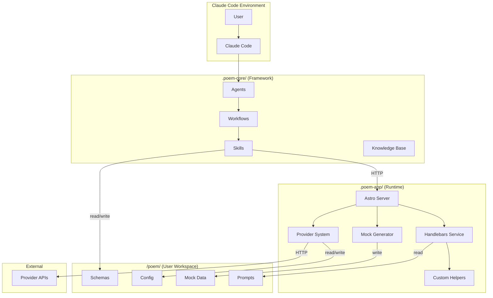

# Components

POEM's components are organized into three installation targets: the framework (`.poem-core/`), the runtime (`.poem-app/`), and the user workspace (`/poem/`).

## Component: Agents (poem-core)

**Responsibility:** Define AI agent personas that guide users through workflows via Claude Code slash commands.

**Key Interfaces:**

- Slash command activation: `/poem/agents/{agent-name}`
- Agent commands: `*new`, `*refine`, `*test`, `*help`, etc.
- Workflow invocation based on user requests

**Dependencies:**

- Workflows (invokes based on user needs)
- Skills (uses for autonomous operations)
- Knowledge Base (consults for POEM principles)

**Technology Stack:** Markdown files with YAML frontmatter (BMAD v4 pattern)

**Agents:**

| Agent             | File                          | Primary Commands                                        |
| ----------------- | ----------------------------- | ------------------------------------------------------- |
| Prompt Engineer   | `agents/prompt-engineer.md`   | `*new`, `*refine`, `*test`, `*validate`                 |
| System Agent      | `agents/system-agent.md`      | `*add-helper`, `*server-status`, `*create-provider`     |
| Integration Agent | `agents/integration-agent.md` | `*connect`, `*pull-dictionary`, `*publish`              |
| Mock Data Agent   | `agents/mock-data-agent.md`   | `*generate-mock`, `*create-scenario`, `*curate-library` |

**Workflow Context Awareness** (✅ Phase 1: Story 3.8, 🔄 Phase 2: Story 4.9):

Agents support **workflow-scoped context**, enabling operation across multiple independent workflows within one workspace.

**Phase 1 Capabilities** (✅ Story 3.8 - Complete):
- **Workflow Management**: Penny has `*workflows`, `*switch <workflow>`, `*context` commands
- **Scoped Operations**: Commands (`*list`, `*new`, `*view`) operate in current workflow context
- **Path Resolution**: Config service provides `getWorkflowPath()` for workflow-scoped directories
- **Persistence**: Active workflow persists across sessions via `.poem-state.json`
- **Isolation**: Prompts in workflow A don't appear when switched to workflow B
- **Reference Configuration**: Reference paths configured as arrays (not yet integrated)
- **Skills**: `list-workflows.md`, `switch-workflow.md`, `show-workflow-context.md`

**Phase 2 Enhancements** (🔄 Story 4.9 - Planned):
- **Reference Integration**: Load context from workflow-specific reference materials
- **Priority System**: Conflict resolution when same file exists in multiple reference sources
- **Shared Resources**: Detection and management of cross-workflow prompts/schemas
- **Workflow Files**: `.workflow.yaml` definition files for complete workflow orchestration
- **Advanced Commands**: `*workflows --verbose`, `*context --reference`, `*list --shared`

**Example**:
```
*workflows                    # List all workflows (shows youtube-launch-optimizer, nano-banana)
*switch nano-banana           # Change to NanoBanana workflow
*context                      # Show current workflow info (paths, references)
*list                         # Lists nano-banana prompts only (isolation)
*new                          # Creates prompt in nano-banana directory
```

**Configuration**: `packages/poem-core/poem-core-config.yaml`
**Limitations**: `docs/architecture/multi-workflow-phase1-limitations.md`
**Background**: `docs/planning/course-corrections/2026-01-12-multi-workflow-architecture.md`

---

## Component: Workflows (poem-core)

**Responsibility:** Define multi-step guided processes as YAML templates that agents execute.

**Key Interfaces:**

- Invoked by agents based on command or user request
- Step-by-step execution with user interaction
- Calls skills and APIs as needed

**Dependencies:**

- Skills (invokes for specific operations)
- Astro APIs (calls for rendering, schema operations)
- User Workspace (reads/writes files)

**Technology Stack:** YAML workflow definitions (BMAD v4 pattern)

**Workflows:**

| Workflow        | File                             | Steps                                                        |
| --------------- | -------------------------------- | ------------------------------------------------------------ |
| New Prompt      | `workflows/new-prompt.yaml`      | Gather purpose → Create template → Generate schema → Preview |
| Refine Prompt   | `workflows/refine-prompt.yaml`   | Load → Test → Identify issues → Update → Repeat              |
| Test Prompt     | `workflows/test-prompt.yaml`     | Select data source → Render → Report                         |
| Validate Prompt | `workflows/validate-prompt.yaml` | Check syntax → Validate schema → Check helpers → Report      |
| Deploy Prompt   | `workflows/deploy-prompt.yaml`   | Validate → Test connection → Publish → Confirm               |
| Add Helper      | `workflows/add-helper.yaml`      | Describe need → Generate code → Register → Test              |

---

## Component: Skills (poem-core)

**Responsibility:** Autonomous single-responsibility capabilities that Claude invokes based on context.

**Key Interfaces:**

- Self-describing (suggest when useful)
- Invoke via context, not explicit commands
- Call Astro APIs for heavy operations

**Dependencies:**

- Astro APIs (HTTP calls for rendering, schema extraction)
- User Workspace (file operations)

**Technology Stack:** Markdown skill definitions

**Skills:**

| Skill             | File                          | Purpose                       |
| ----------------- | ----------------------------- | ----------------------------- |
| Check My Prompt   | `skills/check-my-prompt.md`   | Validate prompt structure     |
| Preview with Data | `skills/preview-with-data.md` | Render with mock/example data |
| Generate Schema   | `skills/generate-schema.md`   | Extract schema from template  |
| Find Fields       | `skills/find-fields.md`       | Search data dictionaries      |
| Validate Schema   | `skills/validate-schema.md`   | Check against dictionary      |
| Suggest Mappings  | `skills/suggest-mappings.md`  | Recommend field mappings      |
| Pull Dictionary   | `skills/pull-dictionary.md`   | Import from provider          |
| Publish Prompt    | `skills/publish-prompt.md`    | Deploy to production          |

---

## Component: Astro Server (poem-app)

**Responsibility:** Provide HTTP server with REST APIs for template rendering, schema operations, and provider integration.

**Key Interfaces:**

- REST API endpoints (see API Specification)
- HTTP calls from skills and workflows
- File system access to user workspace

**Dependencies:**

- Handlebars Service (template operations)
- Provider implementations (external integrations)
- User Workspace (file access)

**Technology Stack:** Astro 4.x, TypeScript, Node.js

---

## Component: Handlebars Service (poem-app)

**Responsibility:** Compile Handlebars templates, register helpers, render with data.

**Key Interfaces:**

- `compile(template: string): CompiledTemplate`
- `render(compiled: CompiledTemplate, data: object): string`
- `registerHelper(name: string, fn: Function): void`
- `extractPlaceholders(template: string): PlaceholderInfo[]`

**Dependencies:**

- Custom Helpers (loaded from helpers directory)
- File System (read template files)

**Technology Stack:** Handlebars.js 4.x

**Initialization:**

1. Server starts
2. Scan `src/services/handlebars/helpers/` directory
3. Load and register all `.js` helper files
4. Watch directory for hot-reload

---

## Component: Custom Helpers (poem-app)

**Responsibility:** Provide domain-specific formatting and transformation functions for Handlebars templates.

**Key Interfaces:**

- Handlebars helper signature: `(args..., options) => string`
- Auto-registered on server start
- Hot-reload on file change

**Dependencies:**

- Handlebars Service (registration)

**Technology Stack:** JavaScript/TypeScript modules

**Built-in Helpers:**

| Helper            | Purpose           | Example                                       |
| ----------------- | ----------------- | --------------------------------------------- |
| `titleCase`       | Title case string | `{{titleCase "hello world"}}` → "Hello World" |
| `upperCase`       | Uppercase string  | `{{upperCase "hello"}}` → "HELLO"             |
| `lowerCase`       | Lowercase string  | `{{lowerCase "HELLO"}}` → "hello"             |
| `truncate`        | Limit length      | `{{truncate title 49}}` → first 49 chars      |
| `default`         | Fallback value    | `{{default value "N/A"}}`                     |
| `json`            | JSON stringify    | `{{json object}}`                             |
| `dateFormat`      | Format date       | `{{dateFormat date "YYYY-MM-DD"}}`            |
| `gt`              | Greater than      | `{{#if (gt count 10)}}`                       |
| `join`            | Join array        | `{{join items ", "}}`                         |
| `formatTimestamp` | MM:SS format      | `{{formatTimestamp 125}}` → "2:05"            |

---

## Component: Provider System (poem-app)

**Responsibility:** Abstract interface for external system integration with concrete implementations.

**Key Interfaces:**

- `testConnection(): Promise<ConnectionResult>`
- `pullDictionary(): Promise<DataDictionary>`
- `publishPrompt(template, schema): Promise<PublishResult>`

**Dependencies:**

- Provider configurations (from user workspace)
- External system APIs

**Technology Stack:** TypeScript interfaces, Astro API routes

**Provider Structure:**

```
src/pages/api/providers/
├── _base.ts           # Abstract provider interface
├── mock/              # Mock provider for testing
│   ├── test.ts
│   ├── dictionary.ts
│   └── publish.ts
└── supportsignal/     # SupportSignal/Convex provider
    ├── test.ts
    ├── dictionary.ts
    └── publish.ts
```

---

## Component: Mock Data Generator (poem-app)

**Responsibility:** Generate realistic fake data from JSON schemas using Faker.js.

**Key Interfaces:**

- `generate(schema: Schema, options: GenerateOptions): MockData`
- Configurable: count, seed, edge cases

**Dependencies:**

- Schema definitions
- Faker.js library

**Technology Stack:** @faker-js/faker

**Generation Strategy:**

| Field Type       | Faker Method                                             |
| ---------------- | -------------------------------------------------------- |
| `string`         | Infer from name (firstName → `faker.person.firstName()`) |
| `number`         | `faker.number.int({ min, max })`                         |
| `boolean`        | `faker.datatype.boolean()`                               |
| `array`          | Generate N items of item type                            |
| `object`         | Recursively generate properties                          |
| With `fakerHint` | Use specified method                                     |

---

## Component: User Workspace (/poem/)

**Responsibility:** Store user-created prompts, schemas, mock data, and configuration.

**Key Interfaces:**

- File system structure
- Read/write by agents and APIs

**Dependencies:** None (leaf component)

**Structure:**

```
/poem/
├── prompts/           # .hbs template files
│   └── youtube-launch-optimizer/
├── schemas/           # .json schema files
│   └── dictionaries/  # Pulled from providers
├── mock-data/         # Generated mock data
│   └── scenarios/     # Named test scenarios
├── workflow-data/     # Persisted workflow state
└── config/
    └── providers/     # Provider configurations
```

---

## Component Diagram



---
