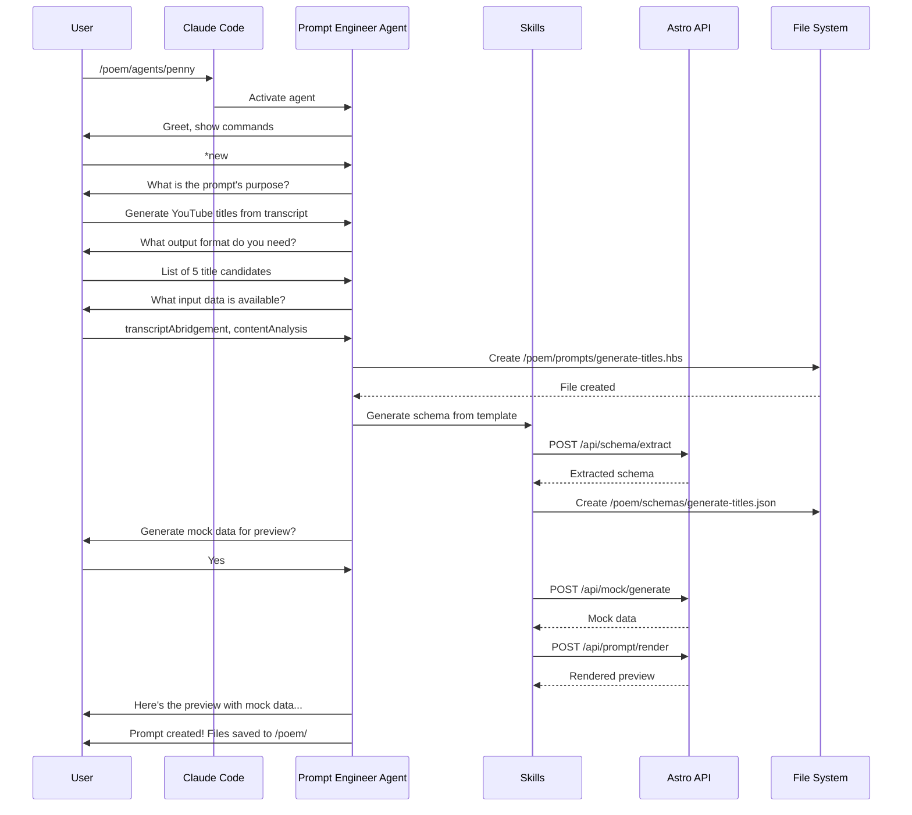
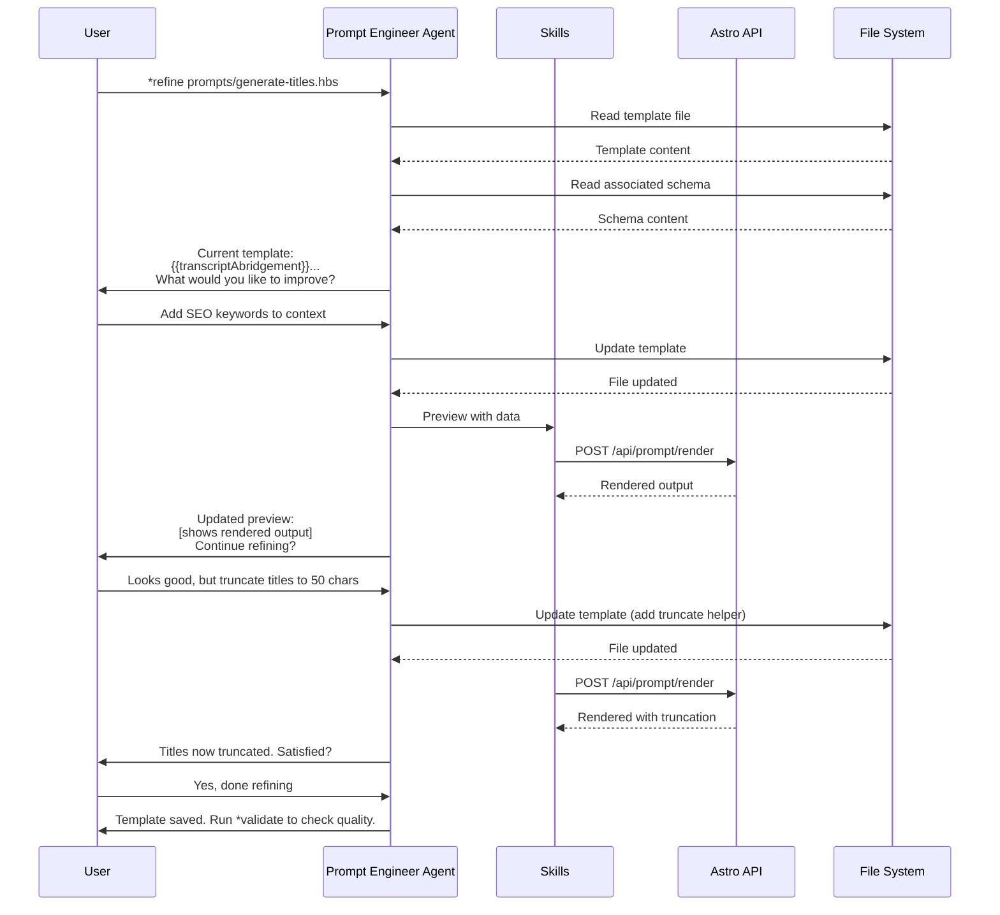
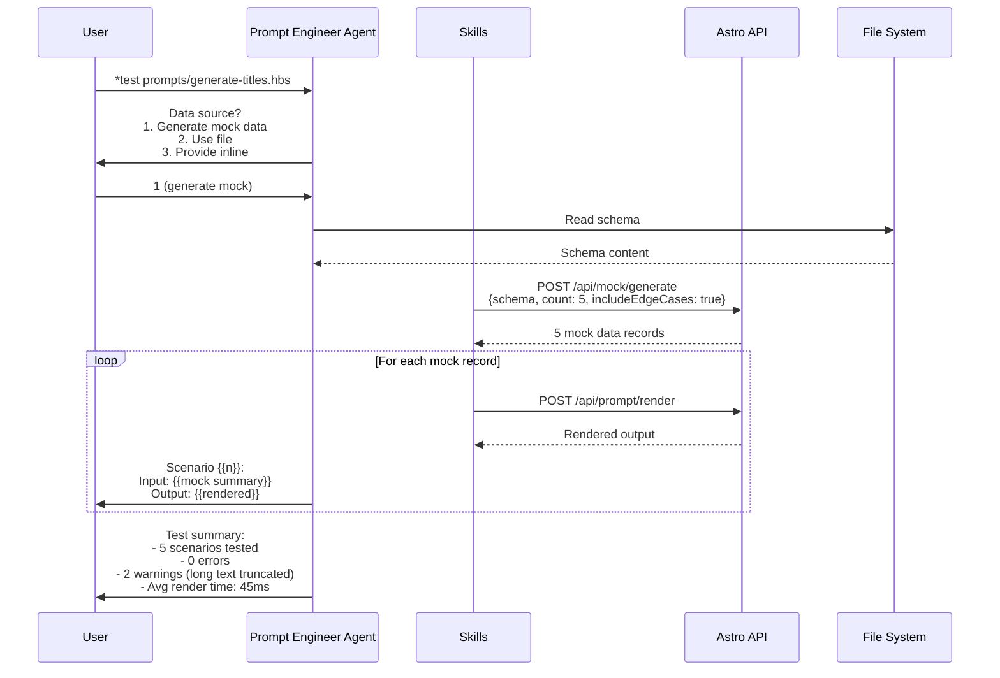
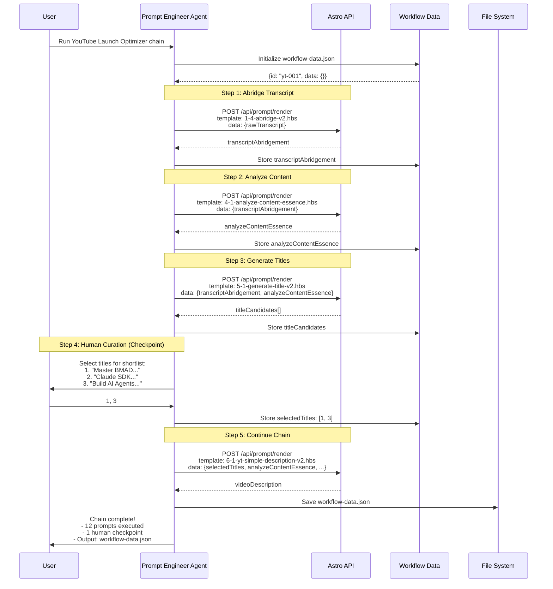
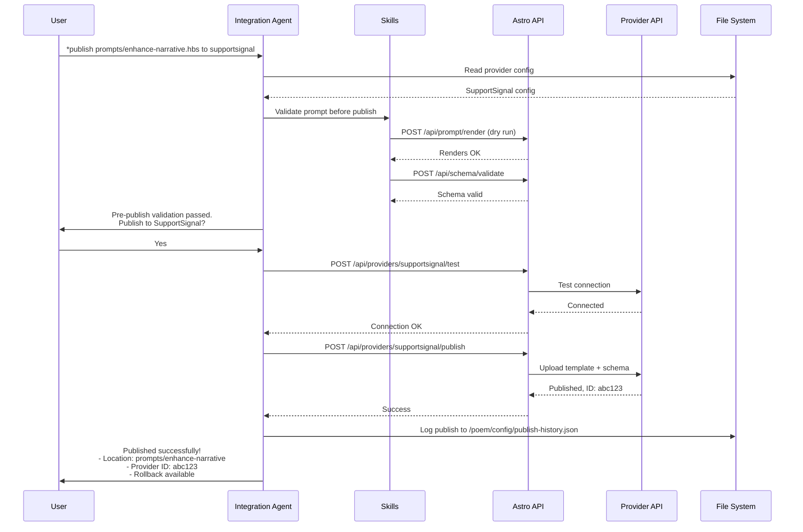

# Core Workflows

These sequence diagrams illustrate the key system workflows.

## Workflow 1: New Prompt Creation



## Workflow 2: Refine Prompt (Iterative)



## Workflow 3: Test Prompt with Mock Data



## Workflow 4: Prompt Chain Execution (YouTube Launch Optimizer)



## Workflow 5: Provider Integration (Publish Prompt)



## Workflow 6: Add Custom Helper

````mermaid
sequenceDiagram
    participant U as User
    participant SA as System Agent
    participant API as Astro API
    participant FS as File System
    participant HBS as Handlebars Service

    U->>SA: *add-helper
    SA->>U: Describe the helper you need

    U->>SA: I need a helper to format YouTube timestamps<br/>Input: seconds (number)<br/>Output: "MM:SS" format

    SA->>SA: Generate JavaScript code

    SA->>U: Here's the helper code:<br/>```js<br/>module.exports = (seconds) => {...}<br/>```<br/>Create this helper?

    U->>SA: Yes

    SA->>FS: Write .poem-app/src/services/handlebars/helpers/formatTimestamp.js
    FS-->>SA: File created

    Note over SA,HBS: Hot-reload detects new file
    HBS->>FS: Load formatTimestamp.js
    HBS->>HBS: Register helper

    SA->>API: POST /api/helpers/test<br/>{helper: "formatTimestamp", args: [125]}
    API-->>SA: "2:05"

    SA->>U: Helper created and tested!<br/>Usage: {{formatTimestamp 125}} → "2:05"<br/>Available immediately.
````

---
