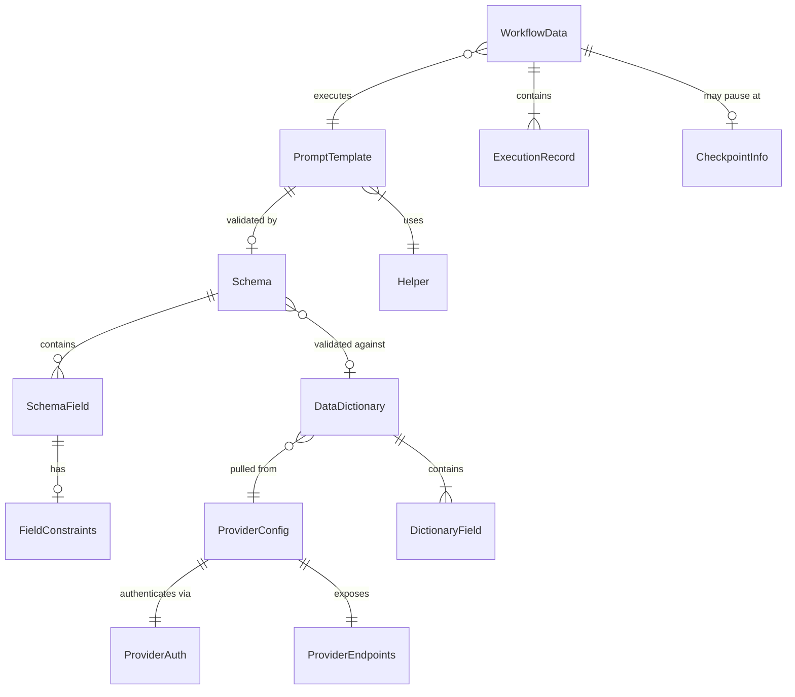

# Data Models

POEM's data models are primarily **file-based documents**, not database entities. These models define the structure of files that users and agents create/manipulate.

## Prompt Template

**Purpose:** Handlebars template file containing an AI prompt with data placeholders.

**Key Attributes:**

- `path`: string - File path relative to `/poem/prompts/`
- `content`: string - Handlebars template content
- `placeholders`: string[] - Extracted placeholder names
- `helpers`: string[] - Required Handlebars helpers
- `schemaPath`: string - Associated unified schema file path

```typescript
interface PromptTemplate {
  /** Relative path from /poem/prompts/ */
  path: string;

  /** Raw Handlebars template content */
  content: string;

  /** Extracted placeholders from template */
  placeholders: PlaceholderInfo[];

  /** Required helper names */
  requiredHelpers: string[];

  /** Associated unified schema path (if exists) */
  schemaPath?: string;
}

interface PlaceholderInfo {
  /** Full placeholder path e.g., "user.name" */
  path: string;

  /** Inferred type from usage */
  inferredType: "string" | "number" | "boolean" | "array" | "object";

  /** Is inside #each block */
  isArrayItem: boolean;

  /** Is inside #if block */
  isConditional: boolean;
}
```

**Relationships:**

- Has zero or one optional Unified Schema (defines input/output data structure)
- May reference many Helpers
- May be part of a Workflow chain

---

## Schema

**Purpose:** JSON document defining the unified data structure for a prompt template, combining both input parameters and output specifications in a single file. Schemas behave like **function signatures**: `(input) -> output`.

**File Naming Convention:**

- **Unified schema:** `{prompt-name}.json` (e.g., `generate-titles.json`)
- Stored in `/poem/schemas/` directory
- Contains both `input` and `output` sections in one file

**Key Attributes:**

- `templateName`: string - Prompt template name (matches template file)
- `version`: string - Schema version for evolution
- `description`: string - Human-readable description (optional)
- `input`: object - Input schema section (required)
- `output`: object - Output schema section (optional)

```typescript
interface UnifiedSchema {
  /** Prompt template name (e.g., "generate-titles") */
  templateName: string;

  /** Schema version */
  version: string;

  /** Human-readable description */
  description?: string;

  /** Input schema section (required) */
  input: {
    fields: SchemaField[];
  };

  /** Output schema section (optional) */
  output?: {
    fields: SchemaField[];
  };
}

interface SchemaField {
  /** Field name (supports dot notation for nesting) */
  name: string;

  /** Field type */
  type: "string" | "number" | "boolean" | "array" | "object";

  /** Is field required */
  required: boolean;

  /** Human-readable description */
  description?: string;

  /** For arrays, the item type */
  items?: SchemaField;

  /** For objects, nested fields */
  properties?: SchemaField[];

  /** Constraints for mock data generation */
  constraints?: FieldConstraints;
}

interface FieldConstraints {
  /** Min/max for numbers */
  min?: number;
  max?: number;

  /** Min/max length for strings */
  minLength?: number;
  maxLength?: number;

  /** Enum values */
  enum?: string[];

  /** Faker.js method hint e.g., "person.firstName" */
  fakerHint?: string;

  /** Regex pattern */
  pattern?: string;
}
```

**Example Unified Schema:**

```json
{
  "templateName": "generate-titles",
  "version": "1.0.0",
  "description": "Generate YouTube video titles",
  "input": {
    "fields": [
      { "name": "topic", "type": "string", "required": true, "description": "Video topic" },
      { "name": "audience", "type": "string", "required": true, "description": "Target audience" }
    ]
  },
  "output": {
    "fields": [
      { "name": "titles", "type": "array", "required": true, "description": "Generated title options" },
      { "name": "count", "type": "number", "required": true, "description": "Number of titles" }
    ]
  }
}
```

**Function Signature Analogy:**

```typescript
// C# style function signature
(string topic, string audience) GenerateTitles() -> (string[] titles, int count)

// POEM unified schema (JSON) - same concept
{
  "input": { "fields": [...] },
  "output": { "fields": [...] }
}
```

**Relationships:**

- Belongs to one or more PromptTemplates
- Used by MockDataGenerator
- May reference a DataDictionary for validation

---

## Workflow Data

**Purpose:** Runtime state that accumulates as prompts execute in a chain.

**Key Attributes:**

- `id`: string - Workflow execution identifier
- `templateChain`: string[] - Ordered list of executed templates
- `data`: Record - Accumulated field values

```typescript
interface WorkflowData {
  /** Unique execution ID */
  id: string;

  /** Workflow name/identifier */
  workflowName: string;

  /** Timestamps */
  startedAt: string;
  updatedAt: string;

  /** Chain of executed templates */
  executedTemplates: ExecutionRecord[];

  /** Accumulated data from all prompts */
  data: Record<string, unknown>;

  /** Current checkpoint (if paused for human input) */
  checkpoint?: CheckpointInfo;
}

interface ExecutionRecord {
  /** Template path */
  templatePath: string;

  /** Execution timestamp */
  executedAt: string;

  /** Fields added to workflow data */
  outputFields: string[];

  /** Render time in ms */
  renderTimeMs: number;
}

interface CheckpointInfo {
  /** Template requiring human input */
  templatePath: string;

  /** Type of input needed */
  inputType: "selection" | "freeform" | "approval";

  /** Options for selection type */
  options?: string[];

  /** Field to store result */
  outputField: string;
}
```

**Relationships:**

- References multiple PromptTemplates (chain)
- Persisted to `/poem/workflow-data/` during execution

---

## Provider Configuration

**Purpose:** Configuration for external system integration.

**Key Attributes:**

- `name`: string - Provider identifier
- `type`: string - Provider type (e.g., 'convex', 'supabase')
- `endpoints`: Record - API endpoint configuration

```typescript
interface ProviderConfig {
  /** Unique provider name */
  name: string;

  /** Provider type */
  type: "convex" | "supabase" | "custom";

  /** Base URL for API calls */
  baseUrl: string;

  /** Authentication configuration */
  auth: ProviderAuth;

  /** Available endpoints */
  endpoints: ProviderEndpoints;

  /** Provider-specific options */
  options?: Record<string, unknown>;
}

interface ProviderAuth {
  /** Auth type */
  type: "bearer" | "api-key" | "basic" | "none";

  /** Environment variable containing credential */
  envVar?: string;

  /** Header name for API key */
  headerName?: string;
}

interface ProviderEndpoints {
  /** Endpoint for pulling data dictionary */
  pullDictionary?: string;

  /** Endpoint for publishing prompts */
  publishPrompt?: string;

  /** Endpoint for testing connection */
  testConnection?: string;
}
```

**Relationships:**

- Used by Integration Agent
- Stored in `/poem/config/providers/`

---

## Data Dictionary

**Purpose:** Field definitions pulled from an external provider.

```typescript
interface DataDictionary {
  /** Provider this dictionary came from */
  providerName: string;

  /** When dictionary was pulled */
  pulledAt: string;

  /** Dictionary version from provider */
  version?: string;

  /** Available fields */
  fields: DictionaryField[];
}

interface DictionaryField {
  /** Full field path */
  path: string;

  /** Field type */
  type: string;

  /** Human description */
  description?: string;

  /** Example value */
  example?: unknown;

  /** Is nullable */
  nullable: boolean;

  /** Enum values if applicable */
  enumValues?: string[];
}
```

**Relationships:**

- Pulled from Provider
- Used for schema validation
- Stored in `/poem/schemas/dictionaries/`

---

## Workflow Definition

**Purpose:** Define a multi-prompt workflow with orchestration logic, sections, and step dependencies.

**Status**: ✅ **Phase 1 Structure Defined** (Story 3.8), ✅ **Phase 2 Integration** (Story 4.9). See course correction `docs/planning/course-corrections/2026-01-12-multi-workflow-architecture.md` for background.

**Key Attributes:**

- `name`: string - Workflow identifier (e.g., "youtube-launch-optimizer")
- `description`: string - Human-readable description
- `version`: string - Workflow version
- `sections`: Section[] - Logical groupings of steps
- `reference`: ReferenceConfig[] - **Array** of reference material sources

```typescript
interface WorkflowDefinition {
  /** Unique workflow identifier */
  name: string;

  /** Human-readable description */
  description: string;

  /** Workflow version */
  version: string;

  /** Workflow sections (logical groupings) */
  sections: WorkflowSection[];

  /** Reference material sources (can be multiple) */
  reference?: ReferenceConfig[];  // ✅ ARRAY of sources
}

interface ReferenceConfig {
  /** Path to reference materials (relative or absolute) */
  path: string;

  /** Reference source type */
  type: 'local' | 'second-brain' | 'external' | 'git-repo';

  /** Optional description of this reference source */
  description?: string;

  /** Priority for conflict resolution (higher = preferred, default: 10) */
  priority?: number;
}

interface WorkflowSection {
  /** Section name */
  name: string;

  /** Section description */
  description?: string;

  /** Steps in this section */
  steps: WorkflowStep[];
}

interface WorkflowStep {
  /** Step identifier */
  id: string;

  /** Prompt template path (relative to workflow prompts/) */
  prompt: string;

  /** Input field names */
  inputs: string[];

  /** Output field names */
  outputs: string[];

  /** Human-readable description */
  description?: string;
}
```

**Example: Multi-Source Reference Configuration**

```yaml
# Example: NanoBanana workflow with multiple reference sources
name: nano-banana
description: AI image generation using Nano Banana Pro JSON prompting
version: 1.0.0

reference:
  # Local project reference materials
  - path: data/nano-banana/reference/
    type: local
    description: API docs and JSON prompting guide
    priority: 10

  # Second brain curated knowledge
  - path: /ad/brains/nano-banana/
    type: second-brain
    description: Curated best practices and examples
    priority: 20

  # External documentation (future - Story 4.9)
  - path: https://github.com/appydave/nano-banana-docs
    type: git-repo
    description: Official Nano Banana documentation
    priority: 5

sections:
  - name: Shot Generation
    description: Generate Nano Banana JSON prompts from scene descriptions
    steps:
      - id: generate-shot
        prompt: prompts/generate-shot.hbs
        inputs: [sceneDescription, shotType, cameraAngle]
        outputs: [jsonPrompt]
        description: Create JSON prompt for image generation
```

**Priority System (Story 4.9)**:
- Higher priority wins conflicts when same filename exists in multiple sources
- Default priority: 10
- Typical: local=10, second-brain=20, external=5
- If `api-docs.md` exists in both local (priority 10) and second-brain (priority 20), second-brain version is used

**Relationships:**

- Has many PromptTemplates (via steps)
- Has many WorkflowData (runtime executions)
- Stored in `/poem/workflows/` or `data/<workflow>/` directory

**Discovery**: Identified during Story 3.7.1 (2026-01-12) when testing Penny on NanoBanana data source.

---

## Entity Relationship Diagram



---
