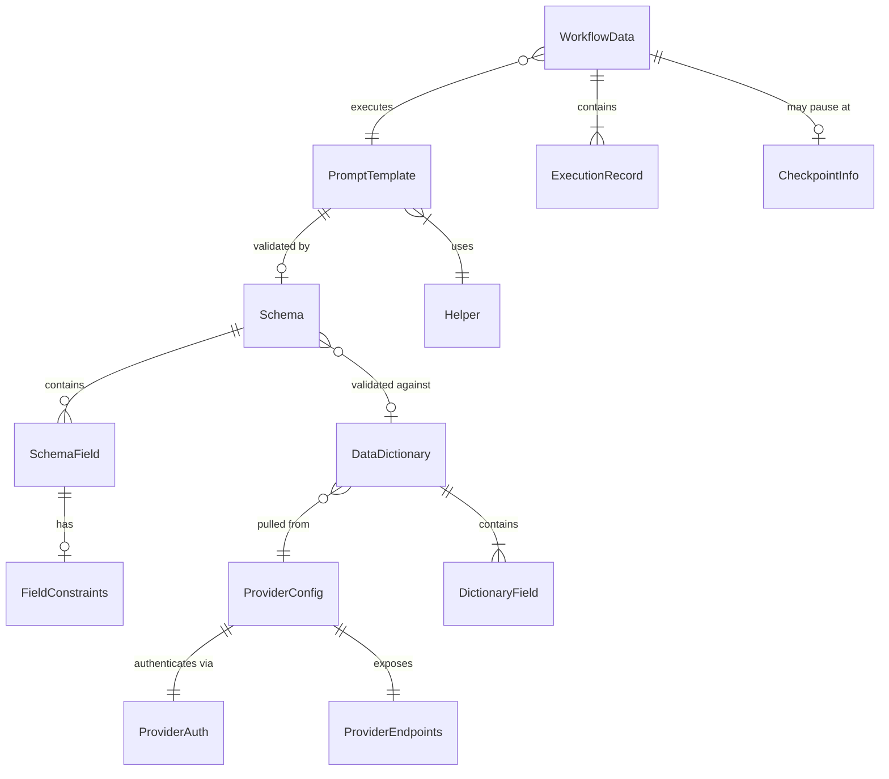

# Data Models

POEM's data models are primarily **file-based documents**, not database entities. These models define the structure of files that users and agents create/manipulate.

## Prompt Template

**Purpose:** Handlebars template file containing an AI prompt with data placeholders.

**Key Attributes:**
- `path`: string - File path relative to `/poem/prompts/`
- `content`: string - Handlebars template content
- `placeholders`: string[] - Extracted placeholder names
- `helpers`: string[] - Required Handlebars helpers
- `schemaPath`: string - Associated schema file path

```typescript
interface PromptTemplate {
  /** Relative path from /poem/prompts/ */
  path: string;

  /** Raw Handlebars template content */
  content: string;

  /** Extracted placeholders from template */
  placeholders: PlaceholderInfo[];

  /** Required helper names */
  requiredHelpers: string[];

  /** Associated schema path (if exists) */
  schemaPath?: string;
}

interface PlaceholderInfo {
  /** Full placeholder path e.g., "user.name" */
  path: string;

  /** Inferred type from usage */
  inferredType: 'string' | 'number' | 'boolean' | 'array' | 'object';

  /** Is inside #each block */
  isArrayItem: boolean;

  /** Is inside #if block */
  isConditional: boolean;
}
```

**Relationships:**
- Has one optional Schema (validation)
- May reference many Helpers
- May be part of a Workflow chain

---

## Schema

**Purpose:** JSON document defining the data structure required by a prompt template.

**Key Attributes:**
- `path`: string - File path relative to `/poem/schemas/`
- `fields`: Field[] - Schema field definitions
- `version`: string - Schema version for evolution

```typescript
interface Schema {
  /** Relative path from /poem/schemas/ */
  path: string;

  /** Schema version */
  version: string;

  /** Human-readable description */
  description?: string;

  /** Field definitions */
  fields: SchemaField[];
}

interface SchemaField {
  /** Field name (supports dot notation for nesting) */
  name: string;

  /** Field type */
  type: 'string' | 'number' | 'boolean' | 'array' | 'object';

  /** Is field required */
  required: boolean;

  /** Human-readable description */
  description?: string;

  /** For arrays, the item type */
  items?: SchemaField;

  /** For objects, nested fields */
  properties?: SchemaField[];

  /** Constraints for mock data generation */
  constraints?: FieldConstraints;
}

interface FieldConstraints {
  /** Min/max for numbers */
  min?: number;
  max?: number;

  /** Min/max length for strings */
  minLength?: number;
  maxLength?: number;

  /** Enum values */
  enum?: string[];

  /** Faker.js method hint e.g., "person.firstName" */
  fakerHint?: string;

  /** Regex pattern */
  pattern?: string;
}
```

**Relationships:**
- Belongs to one or more PromptTemplates
- Used by MockDataGenerator
- May reference a DataDictionary for validation

---

## Workflow Data

**Purpose:** Runtime state that accumulates as prompts execute in a chain.

**Key Attributes:**
- `id`: string - Workflow execution identifier
- `templateChain`: string[] - Ordered list of executed templates
- `data`: Record - Accumulated field values

```typescript
interface WorkflowData {
  /** Unique execution ID */
  id: string;

  /** Workflow name/identifier */
  workflowName: string;

  /** Timestamps */
  startedAt: string;
  updatedAt: string;

  /** Chain of executed templates */
  executedTemplates: ExecutionRecord[];

  /** Accumulated data from all prompts */
  data: Record<string, unknown>;

  /** Current checkpoint (if paused for human input) */
  checkpoint?: CheckpointInfo;
}

interface ExecutionRecord {
  /** Template path */
  templatePath: string;

  /** Execution timestamp */
  executedAt: string;

  /** Fields added to workflow data */
  outputFields: string[];

  /** Render time in ms */
  renderTimeMs: number;
}

interface CheckpointInfo {
  /** Template requiring human input */
  templatePath: string;

  /** Type of input needed */
  inputType: 'selection' | 'freeform' | 'approval';

  /** Options for selection type */
  options?: string[];

  /** Field to store result */
  outputField: string;
}
```

**Relationships:**
- References multiple PromptTemplates (chain)
- Persisted to `/poem/workflow-data/` during execution

---

## Provider Configuration

**Purpose:** Configuration for external system integration.

**Key Attributes:**
- `name`: string - Provider identifier
- `type`: string - Provider type (e.g., 'convex', 'supabase')
- `endpoints`: Record - API endpoint configuration

```typescript
interface ProviderConfig {
  /** Unique provider name */
  name: string;

  /** Provider type */
  type: 'convex' | 'supabase' | 'custom';

  /** Base URL for API calls */
  baseUrl: string;

  /** Authentication configuration */
  auth: ProviderAuth;

  /** Available endpoints */
  endpoints: ProviderEndpoints;

  /** Provider-specific options */
  options?: Record<string, unknown>;
}

interface ProviderAuth {
  /** Auth type */
  type: 'bearer' | 'api-key' | 'basic' | 'none';

  /** Environment variable containing credential */
  envVar?: string;

  /** Header name for API key */
  headerName?: string;
}

interface ProviderEndpoints {
  /** Endpoint for pulling data dictionary */
  pullDictionary?: string;

  /** Endpoint for publishing prompts */
  publishPrompt?: string;

  /** Endpoint for testing connection */
  testConnection?: string;
}
```

**Relationships:**
- Used by Integration Agent
- Stored in `/poem/config/providers/`

---

## Data Dictionary

**Purpose:** Field definitions pulled from an external provider.

```typescript
interface DataDictionary {
  /** Provider this dictionary came from */
  providerName: string;

  /** When dictionary was pulled */
  pulledAt: string;

  /** Dictionary version from provider */
  version?: string;

  /** Available fields */
  fields: DictionaryField[];
}

interface DictionaryField {
  /** Full field path */
  path: string;

  /** Field type */
  type: string;

  /** Human description */
  description?: string;

  /** Example value */
  example?: unknown;

  /** Is nullable */
  nullable: boolean;

  /** Enum values if applicable */
  enumValues?: string[];
}
```

**Relationships:**
- Pulled from Provider
- Used for schema validation
- Stored in `/poem/schemas/dictionaries/`

---

## Entity Relationship Diagram



---
