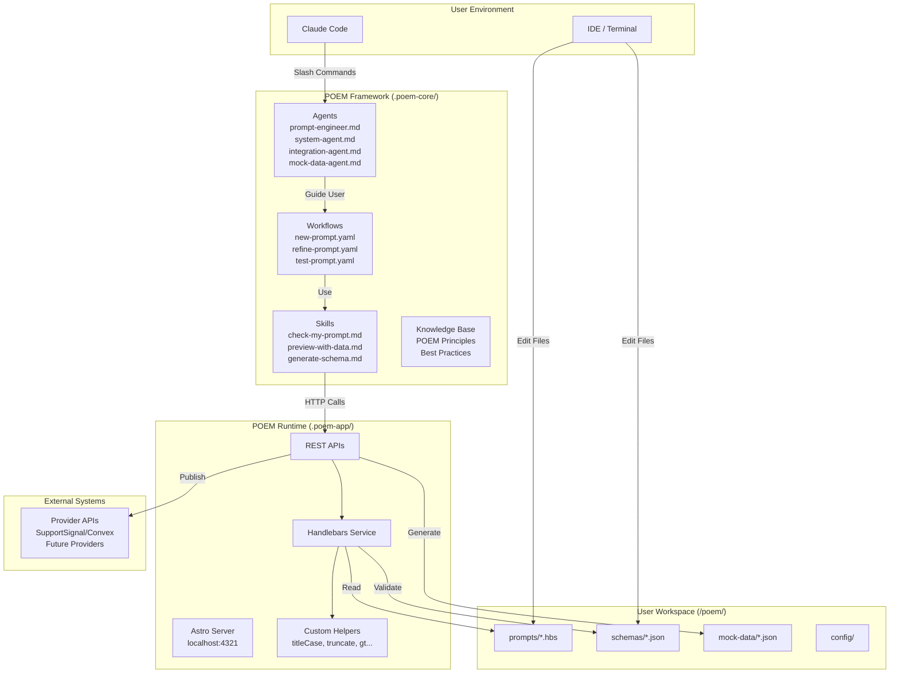

# High-Level Architecture

## Technical Summary

POEM employs a **Document Framework + Local Runtime** architecture pattern, pioneered by BMAD. The system consists of three parts installed into user projects: `.poem-core/` (agents, workflows, skills, knowledge base), `.poem-app/` (Astro server with Handlebars engine and provider APIs), and `/poem/` (user workspace for prompts, schemas, mappings).

The frontend is **conversation-first** — users interact via Claude Code slash commands and agent-guided workflows, not a visual UI. The Astro server runs locally as a background service, providing REST API endpoints for template rendering, schema extraction, and provider integration. This architecture enables offline operation for core functionality while supporting extensible external integrations through the provider pattern.

The key architectural insight is that most "development" in POEM involves creating and editing **documents** (prompts, schemas, workflows), not writing code. The Astro runtime exists solely to provide capabilities that cannot be performed in conversation: Handlebars template compilation, custom helper execution, and HTTP calls to external systems.

## Platform and Infrastructure Choice

**Platform:** Local Development (No Cloud Infrastructure)

POEM runs entirely on the developer's local machine:

- **Runtime**: Node.js (cross-platform: macOS, Linux, Windows)
- **Server**: Astro (local, configurable port)
- **Storage**: File-based (no database)
- **Distribution**: NPM (`npx poem-os install`)

**Key Services:**

| Service              | Technology    | Purpose                                         |
| -------------------- | ------------- | ----------------------------------------------- |
| Template Engine      | Handlebars.js | Compile and render .hbs templates               |
| API Server           | Astro         | REST endpoints for rendering, schema extraction |
| Mock Data            | Faker.js      | Generate test data from schemas                 |
| Package Distribution | NPM           | `npx poem-os install` command                   |

**Deployment Host and Regions:** N/A — Local development tool only. No cloud hosting required.

**Rationale:** POEM is a developer tool, not a deployed application. Cloud infrastructure would add unnecessary complexity. File-based storage ensures data privacy (no production data leaves the user's machine) and enables offline operation.

## Repository Structure

**Structure:** Monorepo with NPM Workspaces

```
poem-os/poem/
├── packages/
│   ├── poem-core/    → Becomes .poem-core/ when installed
│   └── poem-app/     → Becomes .poem-app/ when installed
└── package.json      → Published as 'poem-os' on NPM
```

**Monorepo Tool:** NPM Workspaces (native, no additional tooling)

**Package Organization:**

- `packages/poem-core/` — Document framework (agents, workflows, skills, templates, data)
- `packages/poem-app/` — Astro runtime server (API endpoints, Handlebars service, providers)
- Root — NPX installer, shared configuration, documentation

**Rationale:**

- Single repository simplifies versioning, testing, and release coordination
- NPM workspaces are native and require no additional tooling (Nx, Turborepo unnecessary for this scale)
- Clear separation between framework documents and runtime code

## High Level Architecture Diagram



## Architectural Patterns

- **Document Framework Pattern:** Most system components are documents (Markdown, YAML, JSON, Handlebars) that Claude Code interprets, not executable code. _Rationale:_ Enables rapid iteration through conversation, follows BMAD's proven model.

- **Local Runtime Service Pattern:** A persistent local server (Astro) provides capabilities requiring compilation or external I/O. _Rationale:_ Handlebars needs template compilation; helpers need JavaScript execution; providers need HTTP calls.

- **Agent-Guided Workflow Pattern:** Users interact through specialized AI agents that guide multi-step workflows. _Rationale:_ Provides systematic assistance while maintaining human control over creative decisions.

- **Skill-Based Autonomy Pattern:** Skills are self-describing autonomous capabilities that Claude invokes based on context. _Rationale:_ Enables proactive assistance without requiring explicit user commands.

- **Provider Abstraction Pattern:** External system integration through abstract interfaces with concrete implementations per provider. _Rationale:_ Enables extensibility to new platforms without core framework changes.

- **File-Based Storage Pattern:** All user data stored as files in the workspace directory, no database. _Rationale:_ Simplicity, portability, version control compatibility, offline operation.

- **Schema-Driven Development Pattern:** JSON schemas define data structures; templates, mock data, and validation derive from schemas. _Rationale:_ Single source of truth reduces inconsistencies.

---
